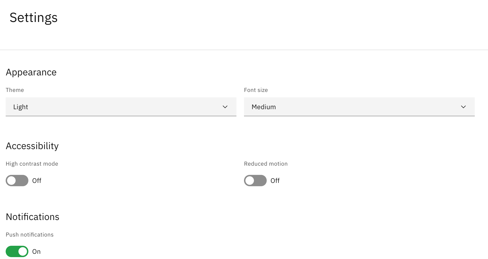

# Adjust your settings

Personalise StaffXP — appearance, accessibility, and notifications — from one place.

1. Open Settings

   Click the **User** icon ▸ **Settings**.

   

2. Appearance

   Set your **Theme** and your **Font size** (**Small**, **Medium**, or **Large**) —
   font size applies across the whole platform.

3. Accessibility

   Toggle **High contrast mode** (boosts legibility, simplifies the interface) and
   **Reduced motion** (minimises animations to reduce eye strain and motion sickness).

4. Notifications

   Toggle push notifications **on** or **off**.

   > **Note:** Every change applies instantly across the platform — there is no
   > need to save.
