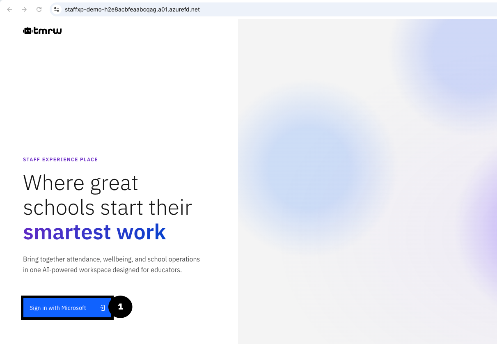
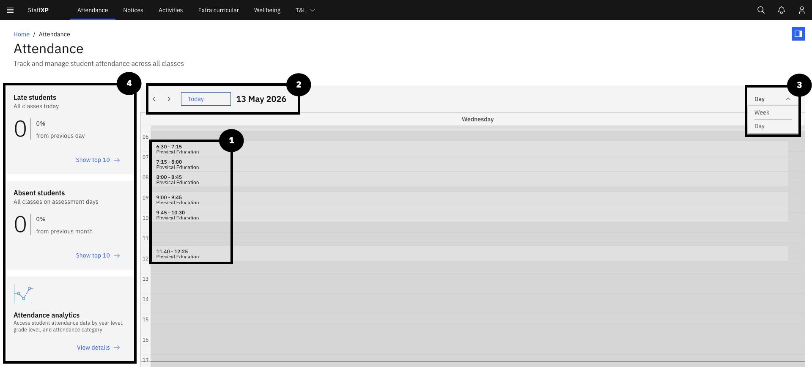

# Navigating the Platform

---

## Staff Login (Entra)

1. Click **Sign in with Microsoft**.
2. Use GEMS M365 login account details (email and password).
3. Click **Sign in**.

---

## Navigation Bar

The **Navigation bar** runs across the top of the screen at all times. 

1. Click on any of the headings or **navigation links** to access the relevant page.
2. **StaffXP** is the landing, home page, also known as the **MyDay** page.
3. On the far left, there is a menu icon where there are links to **training**, **websites**, **reporting** and **administration**.
4. To the right of **StaffXP**, there are navigation links for **Attendance**, **Notices**, **Extra curricular**, **Wellbeing** and **T&L**.

### Attendance

The **Attendance** page allows teachers and admin staff to track attendance for a single school day or within a week.

For Teachers:
1. Teachers will be able to track attendance for their classes. The classes appear as a list in the calendar schedule.
2. Above the calendar, there is a display of today's date. There are arrow keys to change the date.
3. On the top-right corner of the schedule panel, use the **Day / Week** dropdown to switch between **Day and Week** view.
4. On the left of the screen are tiles for information on **Late students**, **Absent students** on assessment days and **Attendance analytics**.

For Administrators/School Leaders:
1. 

### Notices

The **Notices** page displays upcoming and relevant notices to you. You can create and manage notices, and filter them by your interests.

1. Along the top-right of the screen is a dropdown menu to select relevant **Interests** by category.
2. There are options to **create notice** or **Manage notices**.
3. **Featured notices** appear per day.
4. The interests are displayed below the featured notices as tiles. They can also be viewed by filtering into categories.

### Activities

### Wellbeing

### Extracurricular Activities

### Operations (Finance, Budget)

### Employee Self-Service (ESS)

### Profile Search (Own school only)

---

## MyDay Tiles

### School Calendar

### Timetable + Outlook Calendar

### Canteen Specials

### Microsoft To Do

### Professional Learning Summary

### Employee Self-Service (ESS)

---

## User Menu & Settings

### Options

### Dark/ Light Mode

### Apperance Settings

### Profile

### Logout

### Accessibility Settings

---
