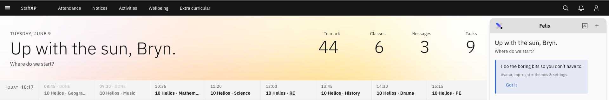
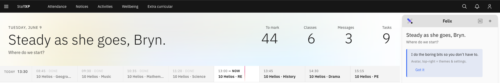
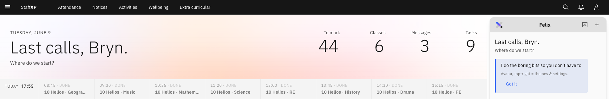

# Navigating the Platform

---

## Staff Login (Entra)

1. Click **Sign in with Microsoft**.
2. Use GEMS M365 login account details (email and password).
3. Click **Sign in**.

---

## Navigation Bar

The **Navigation bar** runs across the top of the screen at all times. 

1. Click on any of the headings or **navigation links** to access the relevant page.
2. **StaffXP** is the landing, home page, also known as the **MyDay** page.
3. On the far left, there is a menu icon where there are links to **Training**, **Reporting** and **Administration**.
4. To the right of **StaffXP**, there are navigation links for **Attendance**, **Notices**, **Wellbeing** and **Extra curricular**.
5. At the far right of the screen, there are icons for **Search**, **Notifications** and **User menu**.
6. The **Search** icon opens up a search bar to search for pages or students.
7. The **Notifications bell icon** opens up into a menu, and is organised into **Messages** or **Alerts**.
8. Under the **User** icon, a menu appears where you can change the theme, view your profile, edit settings or sign out.

### Attendance

The **Attendance** page allows teachers and admin staff to track attendance for a single school day or within a week.

For Teachers:
1. Navigate to the **Attendance** page by clicking the navigation link/ tab in the **Navigation bar**.
2. Teachers will be able to track attendance for their classes. The classes appear as a list in the calendar schedule.
3. Above the calendar, there is a display of today's date. There are arrow keys to change the date.
4. On the top-right corner of the schedule panel, use the **Day / Week** dropdown to switch between **Day and Week** view.
5. On the left of the screen are tiles for information on **Late students**, **Unexcused absences**, and **Absent students** on assessment days.
6. There is a small tile to **View analytics**.

For Administrators/School Leaders:
1. 

### Notices

The **Notices** page displays upcoming and relevant notices to you. You can create and manage notices, and filter them by your interests.

1. Navigate to the **Notices** page, through the **Navigation bar**.
2. There are options to **Manage notices** or **Create notice**.
3. Along the top-right of the screen is a dropdown menu to select relevant **Interests** by category.
4. **Featured notices** appear per day.
5. The interests are displayed below the featured notices as tiles. They can also be viewed by filtering into categories.

### Activities

You can plan for school activities and manage resources on the **Activities** page. Here you can review a shared calendar to see when other planned activities are taking place and what resources they require, to avoid conflicts and ensure resource availability.

1. Select **Activities** from the **Navigation bar**.
2. There are three tiles running across the top of the page: **Request venue**, **Calendar view** and **Request activity**.

> **Note:** *Click the text or arrow on the lower right of each tile to navigate to another page to complete the request.*

3. In the navigation bar below the tiles:
   - **Your requests**: this shows a list of pending or approved activity requests.
   - **Booking status**: this provides a list of the resource bookings and the required quantities.
   - **All venues**: is a list of approved or previously visited venues for school activities.
   - **Parent volunteers**: includes a list of all the parent volunteers who could support with school activities.

> **Note:** *Each of these tabs has a filter and search option.*

### Wellbeing

This is the main space to monitor and support student wellbeing. Here you can create and track wellbeing notes. There are several wellbeing metrics that display the different category trends of wellbeing notes.

### Extra-curricular Activities

This is the landing page for all extra-curricular activities. Here, you can plan, browse, and create new extra-curricular activities. There is a calendar to track all activities and their dates.

1. Click the **Extra-curricular** tab in the **Navigation bar**.
2. There are two tiles below the heading.
   - **Request an extra-curricular activity** allows you to request the creation of a new extracurricular activity.
   - **Extra-curricular calendar** displays a calendar of when different activities occur.
4. Below the tiles, there is a small navigation bar with tabs for **Your request**, **Booking status**, **Supervising activities** and **Staffing** to follow up and track activities.
   - Each tab has a search and filter function to streamline searches.

### Operations (Finance, Budget)

### Employee Self-Service (ESS)

### Profile Search (Own school only)

---

## MyDay Tiles

MyDay is the platform's main landing page and homescreen. When in other pages, return to the MyDay page by clicking the **Staff XP** tab in the **Navigation bar**. The MyDay tiles display information relevant to the day, including Today's schedule, Assignments to mark and a To-Do list. You can also view notices, this week's birthdays, and open wellbeing tasks. Also, there is a **Quick links** tile for quick access to Employee self-service, Topics and FAQs, and to View markbook.

### Adaptive User Interface

The MyDay landing page changes appearance throughout the day to match the time of day the teacher is using the platform.

### School Calendar

Running lengthways on the left side of the screen is **Today's schedule**. There is a list with the task, timing, and location. There is a blue line indicator on the left of the list to show which task is active. After the task's time has passed, the dashed outline of the circle becomes solid blue, with a blue check mark in the middle.

### Timetable 

The timetable of classes for today shows as a banner running across the screen. There is a red line indicator to mark the time and the active class. After the class time has passed, the text fades to grey and the word DONE appears next to the time. 

### Canteen Specials

Daily updates from the school canteen show in the **Canteen specials** tile. The tile displays the dish name, whether it is hot or cold, whether it is a snack, and each dish's price.

### Microsoft To Do

The **To do list** tile links to **Microsoft ToDo**. It shows a summary of upcoming tasks and their due dates.

### Professional Learning Summary

The **Professional learning** tile shows the number of hours of professional learning in a pie chart by category. Below the pie chart is a breakdown of the different professional learning categories, along with completion or planned dates.

### Employee Self-Service (ESS)

Employee Self-Service (ESS) is an area where the user can...

Click **Employee self-service** in the **Quick links** tile to access the page.

---

## User Menu & Settings

The User Menu is where you can personalise the platform to best suit your needs and optimise workflow. 

1. Click the **User** button (shaped like the silhouette of a person).
2. A dropdown menu will show options to change the Theme (from light to dark mode), a **Profile** section, **Settings** and the option to **Sign Out**.

### Options

### Theme

The **Theme** settings affect screen displays. Light mode uses a light background with dark text. Dark mode shows a dark background with light text. Subtle light and subtle dark are tones between light and dark. It may be easier to use light mode in bright light and dark mode in dim light. However, this is entirely up to the user's preferences and comfort.

1. Click the **User** icon.
2. The dropdown menu will show four boxes in a row below the heading **Theme**, showing light to dark mode.   
3. Select the option, and the change will occur instantly.

### Appearance Settings

In the **Settings**, you can manage the appearance of your platform according to your preferences. You can also manage accessibility and whether to receive push notifications.

1. Click the **User** icon ▸ **Settings**.
2. There are two tabs below **Appearance**, **Theme** and **Font size**.
3. To change the **Theme**, click on the dropdown arrow. You can select between **Light**, **subtle light**, **subtle dark** and **Dark**.
4. Selecting the dropdown menu below the **Font size** heading allows you to choose between **Small**, **Medium** or **Large** fonts. These will reflect throughout the platform.
5. **Accessibility** has **on/off** toggles for **High contrast mode** and **Reduced motion**.
6. Enable or disable push notifications in **Notifications** with an **on/off** toggle.
7. After making any changes to the settings, an option to **Save changes** or **Cancel** appears at the top right of the screen. 

### Profile

Your **Profile** page contains all your personal, professional, and work information. The top banner displays your profile picture and job title.

1. Click the **User** icon.
2. Selecting **Profile** from the dropdown reveals three tiles of information on the page.
3. On the left, there is **Personal Information**, first and last names, and date of birth.
4. The middle tile shows **Professional Information**, as your work email address.
5. On the right tile, there is **Work Information**, including job title, company name and office location.

### Sign Out

To log out or sign out means to successfully close or end your session on the device. You will need to sign in again with your credentials after signing out. It is recommended to log out of your account if multiple users are on the same computer. 

1. Click the **User** icon.
2. Scroll to the last option on the dropdown and click **Sign Out**.
3. This will automatically return you to the sign-in page.

   
### Accessibility Settings

These are found in the **Settings** section of the **User** menu. There are options to toggle each setting **on/off**.
   - **High contrast mode** is a feature to support users with visual difficulties or impairments. Here, the colours change, and the platform interfaces are simplified to maximise legibility.
   - **Reduced motion mode** minimises or reduces animations throughout the platform. This feature is designed to reduce eye strain, headaches, and motion sickness for users with vestibular disorders.

---
