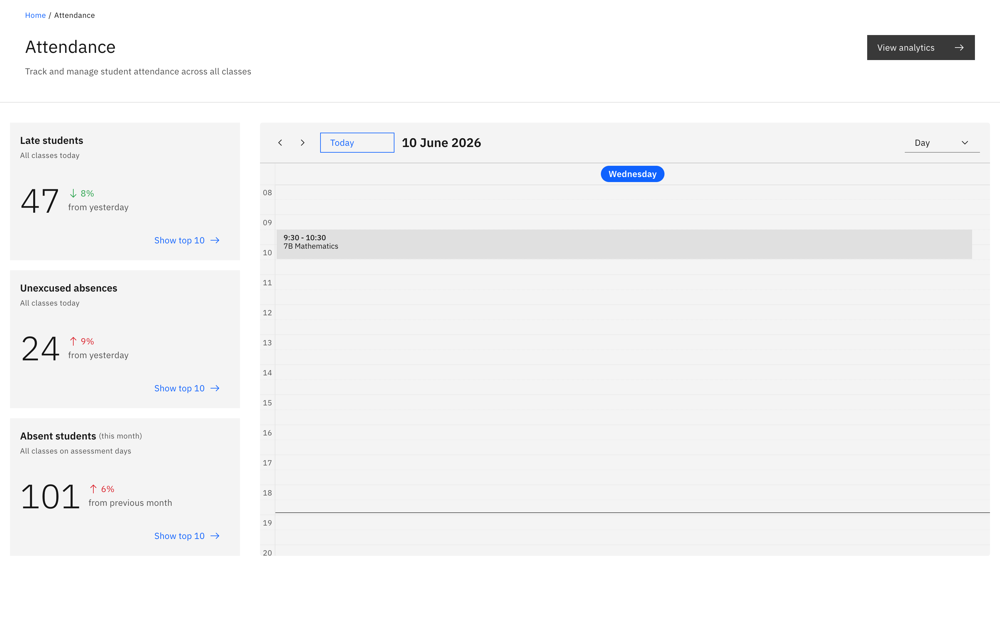
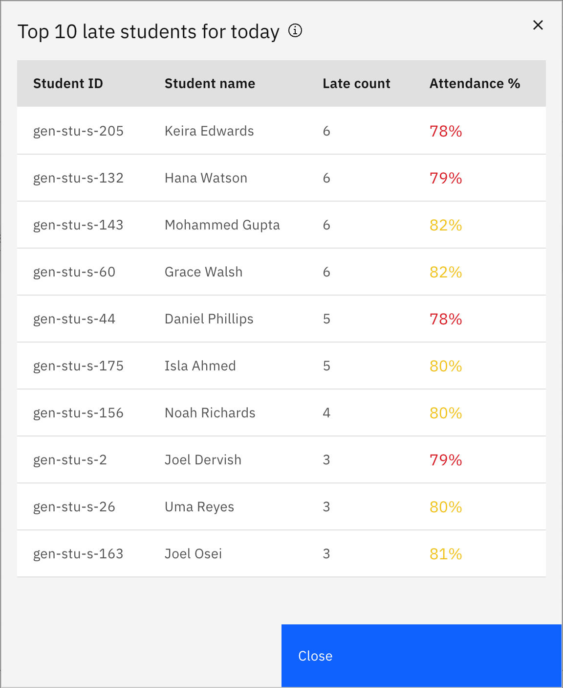

# Use your Attendance page

The Attendance page is your teacher landing screen: three stat cards across the
top and a calendar of your day's classes below. The same **Attendance** nav item
opens a whole-school dashboard instead if you're a school leader or attendance
officer.

1. Open Attendance

   Click **Attendance** in the main navigation. As a regular teacher you land on
   the stat cards and your day's calendar.

   

2. Read the three stat cards

   The cards summarise today across all your classes: **Late students** and
   **Unexcused absences** (both for today), and **Absent students** (this month,
   on assessment days). Each card shows a count with a "from yesterday" or "from
   previous month" change.

3. See who's in a card

   Click a card's **Show top 10** to open a list of those students.

   

4. Open a class roll

   The **calendar** shows your classes for the day. Click a class to open its
   roll and start marking students.

5. View analytics

   Click **View analytics** (top right) to open Attendance analytics. The link
   is only enabled if you have attendance-analytics access.
