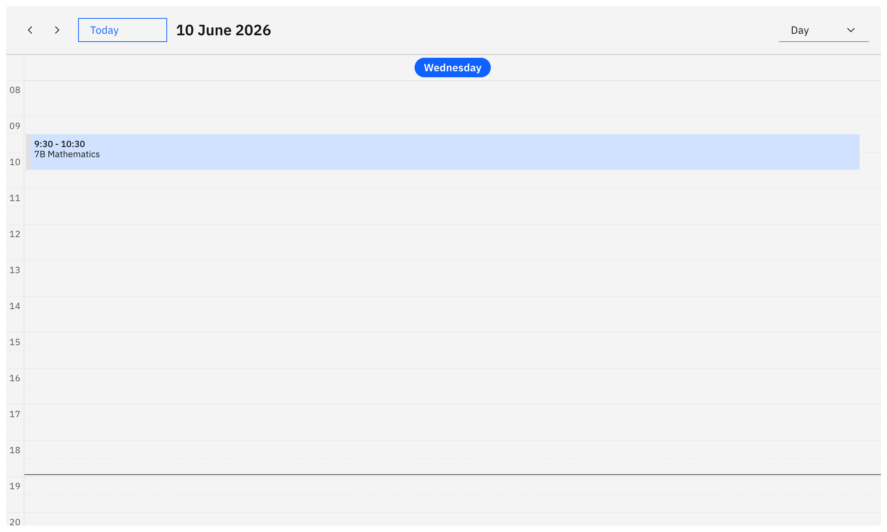
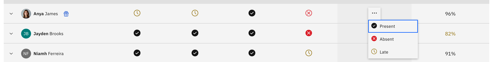
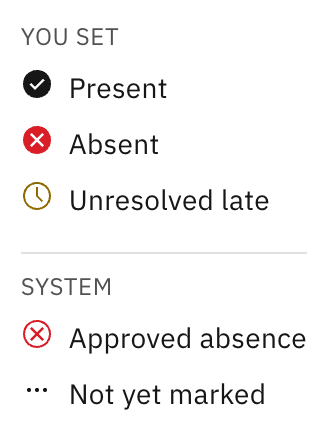

# Take the daily roll

Taking the roll is the core teacher task: open your class, mark every student,
and submit.

1. Open the class roll

   From the **Attendance** page, click your class on the **calendar**, follow a
   **roll reminder**, or ask Felix ("take the roll"). The page header shows the
   **class name**, the **period and student count** (for example "Period 2 · 24
   students"), and the date.

   

2. Read the roll table

   The **Attendance roll** table lists every student on one page — there's
   deliberately no pagination, so nobody gets missed. Each row shows an avatar,
   the student's name (first name bold), and their **Attendance %**. On the left,
   you can see up to 4 prior sessions as read-only history, and on the right,
   today's editable column. You can only mark today's column; the prior sessions and
   approved absences cannot be changed.

4. Mark each student

   Click the **status icon** in today's column to open the menu, then pick
   **Present**, **Absent**, or **Late**. The menu only shows options different
   to the current status. To mark all students at once, use the action
   control on the today column header (**All present** / **All absent**), then
   adjust individuals if needed. Bulk marking skips students who already hold an
   approved absence.

   

5. Submit the roll

   When all the students have a valid status, the **Submit** button enables —
   click it. Submit stays disabled until no student is left on **Not yet marked**
   (the `···` default), so you can't submit a partial roll. It's also disabled
   while you're offline. A success toast confirms with "Attendance submitted";
   if you came from a roll reminder and have more classes to complete, the toast
   offers a **"Take roll for [next class]"** shortcut.

   > **Note:** Once submitted, a roll is locked — there's no direct edit. To fix
   > a mistake, ask Felix to log a correction request, which an attendance
   > officer resolves.

6. Check what the icons mean

   The roll uses icons, not words. Click the **information (ⓘ)** icon next
   to the **Attendance roll** title to open the key. There are two status
   groups, statuses you set — **Present**, **Absent**, **Unresolved late** — and
   system statuses: **Approved absence** (resolved by an officer elsewhere, so not
   editable by you; clicking it opens the absence's details) and **Not yet marked**
   (the default before you mark, which still blocks Submit).

   
