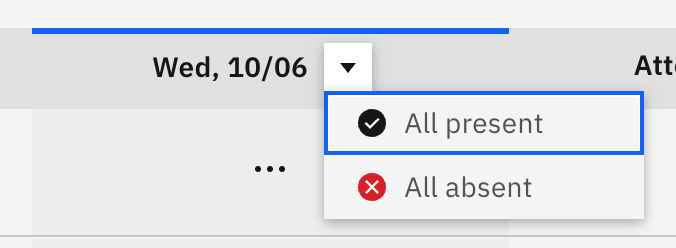

# Mark a whole column at once

When most of a class is present, you can set today's whole column in one go
instead of marking each student. This needs **Attendance write** access (the
same access used to take a roll); for read-only staff the column control is
hidden.

1. Open the column menu

   On the roll, click the **action control on today's column header**. The menu
   reflects the column's current state.

   

2. Mark everyone at once

   Choose **All present** or **All absent**. Every student in today's
   column is set to that status, except any student who already holds an
   **approved absence** — bulk marking skips those so it never overwrites a
   resolved absence.

3. Clear the column if needed

   To start over, open the menu again and choose **reset**, which clears your
   pending marks for today's column.

4. Submit the roll

   Bulk marking doesn't save on its own. After the column is set, adjust any
   individual students as needed, then click **Submit** to send the roll.
