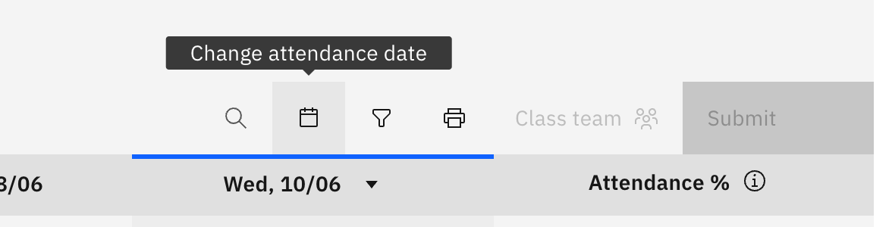

# View a past session (change the roll date)

The roll opens on today by default. Use the date picker to look back at an
earlier session for the same class.

1. Open the date picker

   On the roll toolbar, click the **calendar icon** (**Change attendance date**).

   

2. Pick a date

   Choose a day in the popover. The roll reloads on that date, showing how the
   class was marked. The date travels in the page address, so a link to a
   specific day's roll is shareable.

   For a teacher, a past session opens **read-only** — you can review the marks
   but the cells are locked, and you mark only today's column. An attendance
   officer can still edit a past-dated roll.
