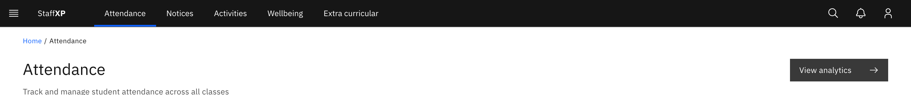
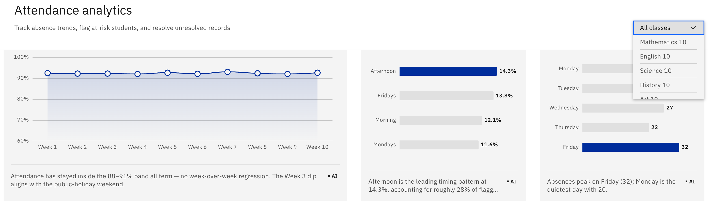

# View attendance analytics

The analytics screen shows attendance patterns, a risk banner, and the at-risk
student list. You need **Attendance-analytics read** access; without it the
**View analytics** button stays disabled.

1. Open the analytics screen

   On the teacher **Attendance** page, click **View analytics** (top right). You
   can also reach it from a **View trends** tile on a leader or officer
   dashboard.

   

2. Check the at-risk banner

   An **at-risk banner** sits at the top. Its **flagged-students** action opens
   the at-risk modal listing the students currently below the attendance
   threshold.

3. Read the stat cards

   Four cards summarise the picture: **Attendance rate** (which shows a "below
   threshold" warning when it drops low), **Late students**, **Unexcused
   absences**, and **Absent students**.

4. Explore the trends charts

   The **Trends** section holds an attendance trend line, an absence-timing
   chart, and an absence-by-day chart. Use the **by class** filter to focus the
   charts on a single class.

   

5. Work the at-risk table

   The **at-risk table** lists flagged students. Filter it by **year group** and
   by risk level to narrow to the students you want to follow up.
