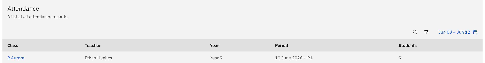

# Find and open any class roll

From the **Attendance overview** dashboard you can drill into any class's roll
across the whole school — not just your own. This needs **School leader** or
**attendance officer / admin** access; a regular teacher reaches rolls from
their own calendar instead.

1. Find the Class rolls table

   On the dashboard, scroll to the **Class rolls** table below the chart row. It
   lists every class's roll.

   

2. Search and filter

   Use the **Search** box to find a class or teacher by name, and the **filter**
   to narrow to a single year group.

3. Set a date range

   Click the **calendar trigger** to set a **date range**, so you can find a past
   session rather than today's.

4. Open the roll

   Click a **class name** to open that roll. It opens with your extra editing
   powers where they apply, and inherits the class's year-group attendance
   setting — either AM/PM or Period, never both.
