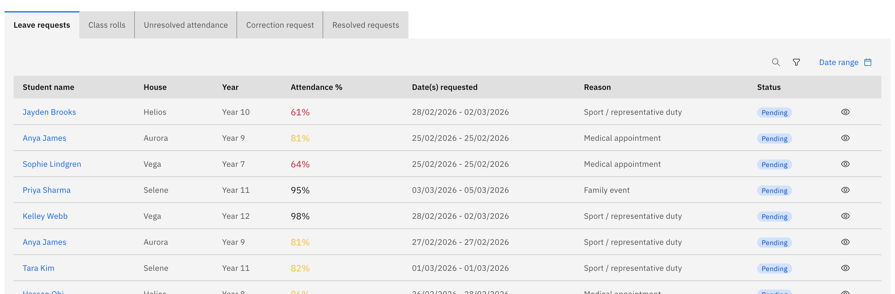

# Resolve and correct attendance marks

Attendance officers clear requests and unresolved marks from tabs on the
dashboard. These tabs and the powers below are **officer-only**; teachers don't
see them.

1. Open the officer tab bar

   On the **Attendance overview**, the officer tab bar lists the work waiting
   for you: **Leave requests** (approve or decline parent-submitted leave),
   **Class rolls** (open any roll to edit), **Unresolved attendance** (marks
   that still need a resolution category), **Correction request** (teacher
   correction requests to action), and **Resolved requests** (the history of
   what you've already cleared).

   

2. Pick a tab and work the list

   Open the relevant tab and action each item in turn. For **Leave requests**,
   approve or decline. For **Unresolved attendance** or **Correction request**,
   open the roll to make the change.

3. Change a cell and choose a reason

   When you change a cell on a roll, a **category picker** opens so you set the
   specific reason rather than just Present, Absent, or Late — for example
   Absent then *Excused: Sick* or *Holiday*. Cells you've changed show a hover
   tooltip with the correction history.

4. Use your officer powers

   You can **edit past-dated rolls** and **change approved absences** — the
   date lock and resolved-absence lock that apply to teachers don't apply to
   you.

5. Submit the corrections

   Click **Submit** to save. Your submit sends **partial corrections**, so you
   don't need every student marked — the all-marked gate is teacher-only.
   Resolved items move to the **Resolved requests** tab.
