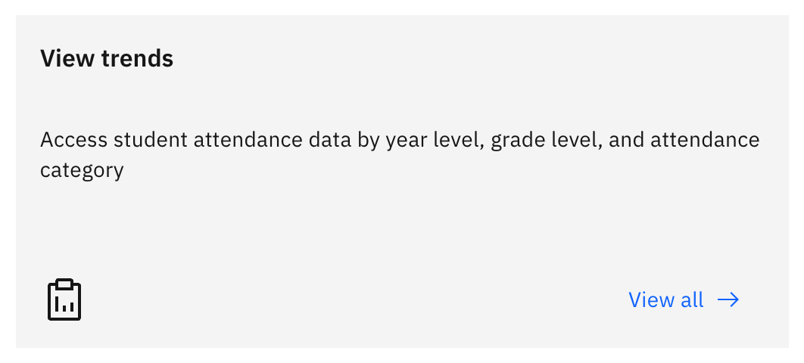
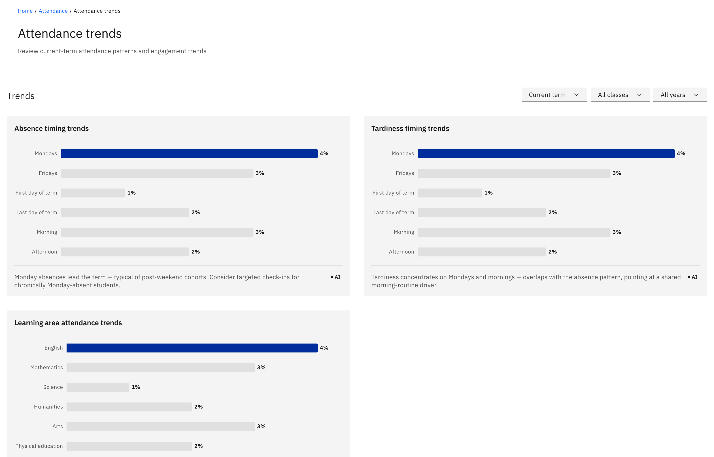

# View attendance trends

Attendance trends is a leader and officer view that shows when absence and
lateness tend to happen, as pattern bar charts. You need **school leader** or
**attendance officer** access to reach it — the **View trends** tiles only
appear on the leader / officer dashboard.

1. Open Attendance trends

   On the **Attendance overview**, click a **View trends** tile. It opens the
   **Attendance trends** page.

   

2. Set the filters

   Use the **period**, **class**, and **year** filters at the top of the page to
   frame what you're looking at.

3. Read the three trend lists

   Three bar lists sit down the page: **Absence timing trends** (when absences
   cluster), **Tardiness timing trends** (when lateness clusters), and
   **Learning-area attendance trends** (attendance by subject area). Each list
   plots its pattern as horizontal bars with a one-line summary above it.

   
