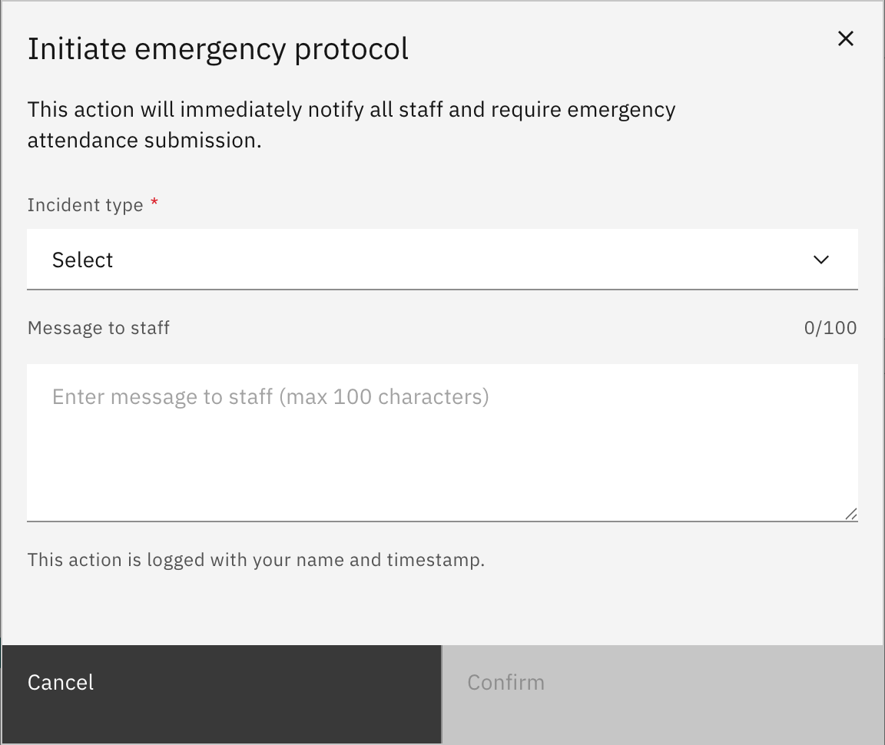

# Start an emergency roll

Declaring an emergency flips the whole school into evacuation/lockdown
attendance: every teacher's roll switches to a fast headcount. Only a school
leader can do this — other roles never see the **Emergency** button.

1. Click the red Emergency button

   In the **top app toolbar**, click the red **Emergency** button. This control
   only appears for school leaders, so if you can't see it you don't have
   permission to declare an emergency.

   

2. Choose the incident type and message

   In the **Initiate emergency protocol** dialog, choose an **Incident type**
   (required) and, if you want, type a **Message to staff** (up to 100
   characters).

   

3. Confirm to start the emergency

   Click **Confirm**. This immediately notifies all staff and turns every
   teacher's roll into a stripped-down **Emergency roll**, and the
   emergency-coordinator and muster-coordinator screens become available. The
   action is logged with your name and a timestamp.

   > **Note:** Confirming alerts everyone in the school at once and forces all
   > staff into emergency attendance. Only declare a real emergency or a planned
   > drill.
