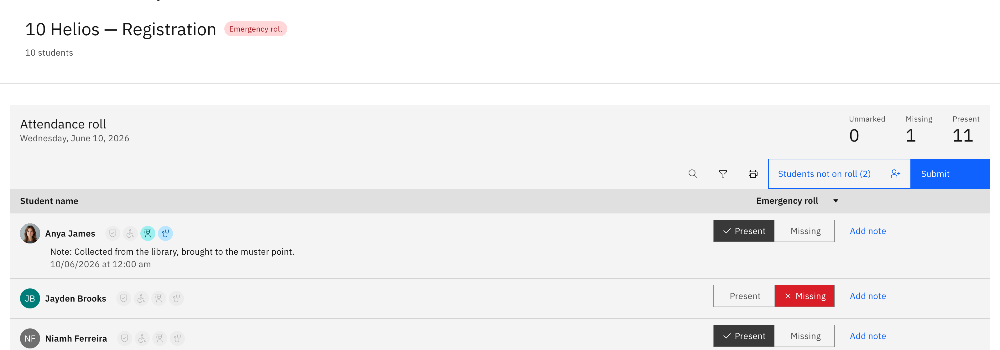
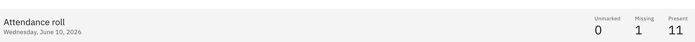

# Take the emergency roll

Once a school leader declares an emergency, every teacher's open roll switches
into a stripped-down headcount. Every teacher does this — the Emergency button
that starts and ends an emergency is leader-only, but taking the emergency roll
is for everyone.

1. Your roll becomes the Emergency roll

   When an emergency is declared, your open roll flips automatically — a red
   **Emergency roll** tag appears in the header, and all staff are notified. The
   table strips back to two columns, **Student name** and **Emergency roll**, so
   per-period history and Attendance % are hidden and nothing competes with
   marking.

   

2. Mark each student Present or Missing

   Tap each student **Present** or **Missing**. To set everyone at once, use the
   **mark all** action in the column header, then adjust individuals. A live
   counter strip in the card header shows running **Unmarked**, **Missing**, and
   **Present** totals.

   

3. Add a note where needed

   Add a **note** to any student to pass on detail — for example where a missing
   student was last seen.

4. Submit your class's status

   Click **Submit** to send your class's emergency status. Unlike a normal roll,
   there's no all-marked gate here — you submit what you have, fast, and
   coordinators chase the rest. Emergency mode is deliberately minimal: no date
   picker, no print, no birthday cue. A confirmation tells you the roll has been
   submitted.
