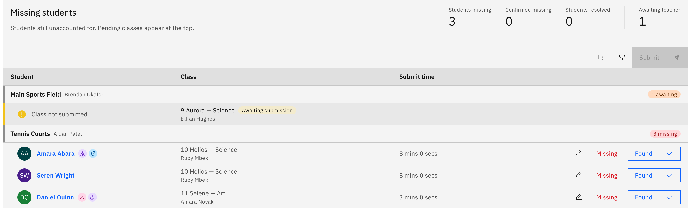
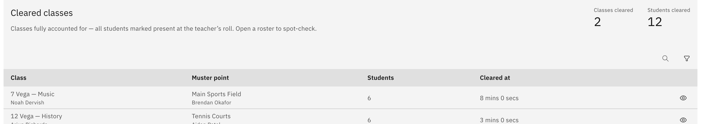
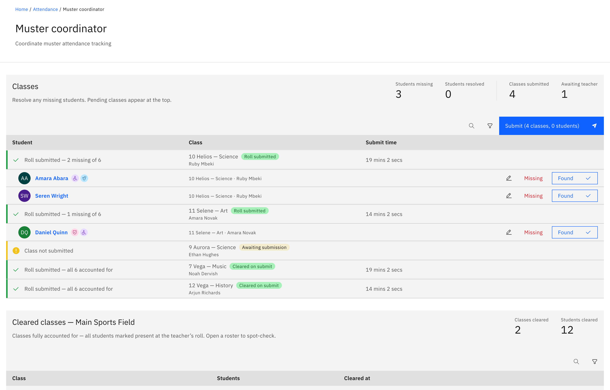

# Coordinate the muster

When a leader declares an emergency, coordinators get live screens to watch the
whole evacuation and confirm every class is accounted for. The page you see
depends on your role, and both pages exist only while an emergency is active.

1. Open your coordinator page

   These screens appear automatically once an emergency is declared. As an
   **emergency coordinator** or school leader you get the **Emergency
   coordinator** page; as a **muster-point coordinator** you get the **Muster
   coordinator** page for your own point. If you don't hold one of these roles,
   the pages don't appear — you take the emergency roll like everyone else.

2. Watch the whole school (Emergency coordinator)

   The **Emergency coordinator** page shows a live **muster table** of all
   classes and muster points so you can see at a glance which classes have
   submitted and where students still need accounting for. The figures update as
   teachers submit their emergency rolls.

   

3. Confirm cleared classes

   A **Cleared classes** table lists the classes that are fully accounted for, so
   you can focus on the ones still outstanding.

   

4. Watch your own muster point (Muster coordinator)

   The **Muster coordinator** page shows just your muster point's headcount and
   the cleared classes for that point — your slice of the evacuation rather than
   the whole school.

   

5. End the emergency (leaders only)

   Only a school leader can end an incident: on the **Emergency coordinator**
   page they click **Turn off emergency protocol** and confirm. Coordinators see
   all the live data but can't end the emergency themselves.
