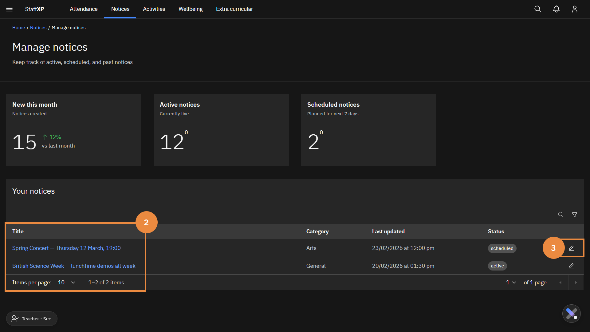

# Notices

---

### Create a notice

1. Click **Notices** in the **Navigation bar**.
2. Click **Create notice +** in the top right corner.
3. Fill in the **Notice details** of the pop-up window:
   - Add a **Notice title**
   - Select the **Notice category** from the dropdown menu.
   - Add a **Notice description**.
   - Optionally, you could add a thumbnail image, ensuring it supports the accepted file size and format.
   - Select whether an RSVP is required (yes or no).
   - Select the relevant date and time.
   - Add a **Reference link title** and **Reference link** if needed.
   - You can also supply a supporting document if needed. Check the file requirements.
4. Click **Next**.
5. Complete the **Audience type** section of the notice.
6. Select who can see the notice: Staff, Parents, Students.

> **Note:** *Especially if the notice is being sent to parents, ensure it complies with communication guidelines.**

7. In **Select staff**, identify the relevant staff the notice will be shared with.
8. Under **Year groups**, select the year groups the notice is relevant to.
9. Click **Next**.
10. Under the **Visibility** tab, fill in the **From** and **Until** fields. The notice will be visible to your audience during this time.
11. Select **Yes** or **No** to determine if the notice should be repeated.
12. Review the details of the notice in the **Review and Publish** tab. If necessary, make edits by pressing **Back**.
13. If the information and tone are correct, press **Publish**.

### Set a notice to be featured

**Featured notices** appear above all the other notices. There is a yellow star on the top right of the thumbnail image. Featured notices are important or urgent and require attention. Featured notices will only appear while they are active. If the notice's active time has elapsed, it will no longer appear in the featured area.

1. In the **Notices** tab, click **Manage notices**.
2. Scroll down to **Notices** below the two tiles.
3. Use the **Search** or **Filter** functions to find the notice (if needed).
4. Click the **star icon (☆)** in the Action column on the right of the screen.
5. The icon will fill to a solid blue, and a pop-up message will appear: Featured updated. This notice is now featured.
6. To remove a notice from the featured banner, click the solid **star icon (★)**. A confirmation message appears: Featured updated. This notice is no longer featured.

### Edit a notice

> **Note:** *You can only edit a notice that you have created.*

1. In the **Notices** tab, click **Manage notices**.
2. Find the notice you want to edit.
> **Note:** *You can filter your notices via the **Active notices** and **Scheduled notices** tile.*
3. Click **edit icon**.
4. Expand the appropriate sections to edit the notice.
5. Make the edits as needed.
6. Click **Save changes**.

### View user-created notices

1. In the **Notices** tab, click **Manage notices**.
2. Scroll down to **Notices** below the two tiles.
3. There is a list of user-created notices.
4. Use the **Search** or **Filter** functions to find the notice (if needed).

### View published notices

1. In the **Notices** tab, click **Manage notices**.
2. Click on the number on the **Active Notices** tile to see all active published notices.
3. Scroll down to **Notices** below the two tiles.
4. There is a list of user-created notices.
5. Use the **Search** or **Filter** functions to find the notice (if needed).

### Set and update personal interests

This feature allows you to customise and view the **Notices** types most relevant to you first. These appear under the **Your interests** tab.

1. In the **Notices** page, there is a navigation bar below the heading.
2. To the right, there is a **filter icon** to filter the notices as needed.
3. Right of the icon is an **Interests** dropdown menu.
4. Select the category or categories as required. (General, Arts, Community, Cultural, Sport). The page will update immediately.

> **Note:** *All notices can still be viewed under their corresponding tabs.*

---
