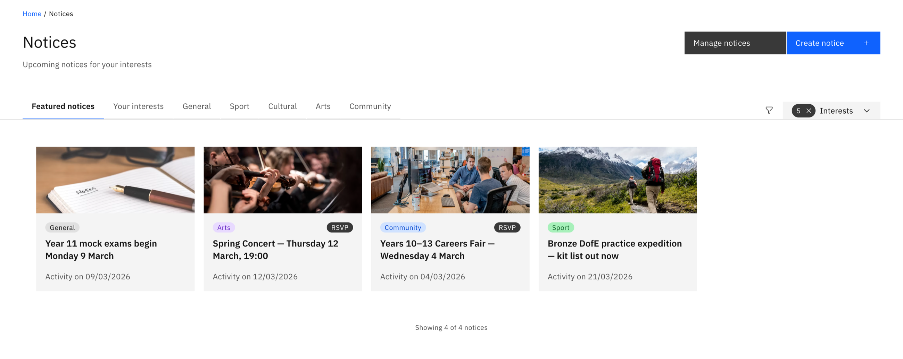

# Find and read notices

The Notices board is the school's noticeboard. Notices show as cards, grouped
into tabs.

1. Open the board

   Click **Notices** in the menu. The board opens on a set of tabs — **Featured**,
   **Your interests**, and one tab per category (**General**, **Sport**,
   **Cultural**, **Arts**, **Community**).

   

2. Read a notice

   Click a card to **flip it over**. The back shows the full description, the
   activity date and time, the author, any attachments or links, and an **RSVP**
   button if the notice takes RSVPs.

   > **Note:** You only see notices aimed at your audience while they're within
   > their visible dates — so your board won't match a colleague's.
