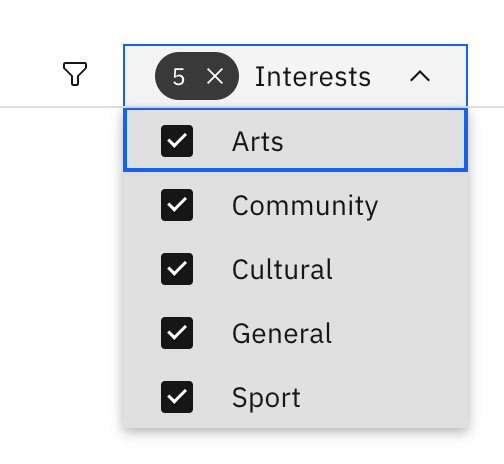

# Follow notice categories

Select notice categories you want to follow. These appear first under the 
**Your interests** tab.

1. Open the Interests dropdown

   On the **Notices** board, click the **Interests** dropdown at the top right next
   to the filter icon.

   

3. Pick your categories

   Check the categories you wish to follow: **General**, **Sport**, **Cultural**,
   **Arts**, and **Community**. Uncheck to unfollow. Choices save automatically.

   > **Note:** This is personal to you — it doesn't change what anyone else sees,
   > and every notice is still available under its own category tab.
