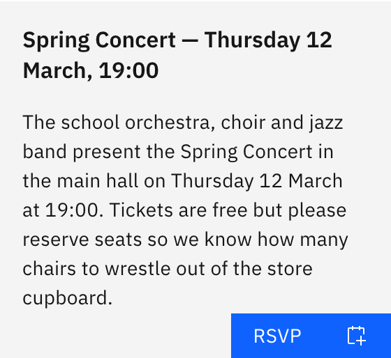

# RSVP to a notice

Some notices are events you can RSVP to. Notices that take RSVPs show an **RSVP**
tag on the card front.

1. Open the notice

   On the **Notices** board, click the card to **flip it over**, then click
   **RSVP** on the back.

   

2. Accept the event

   A confirmation shows the event title and date. Click **Accept**.

   > **Note:** Accepting **adds the event to your Outlook calendar** — it's a
   > calendar add, not a yes/no reply to the organiser. You can only RSVP once;
   > afterwards the button is disabled so you can't add it twice.
