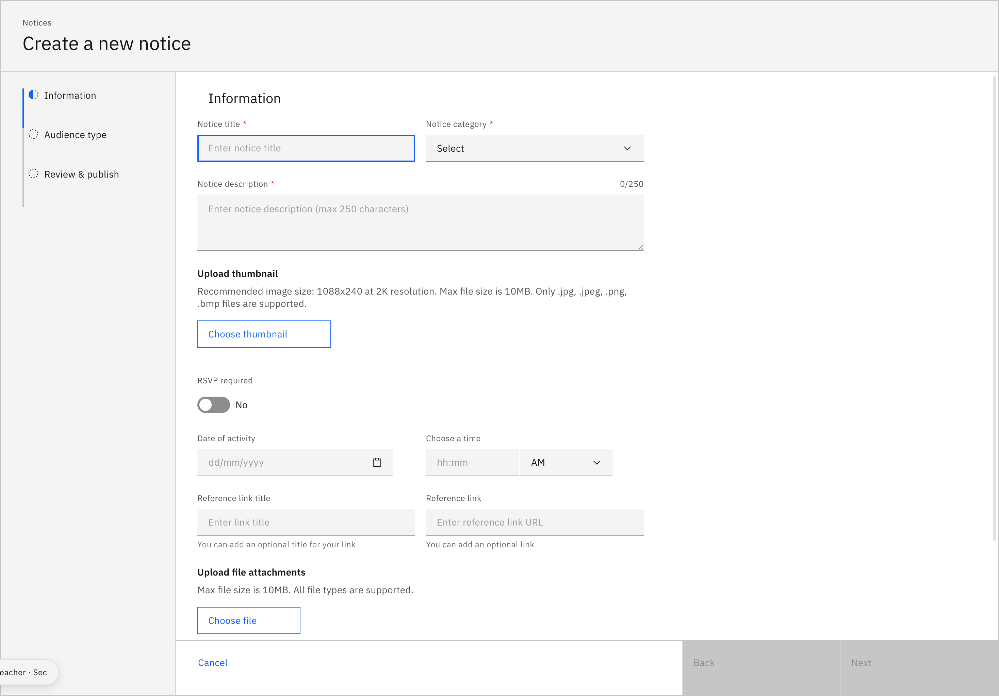

# Create a notice

Notices are announcements you publish to staff, parents, and/or students.
Creating one is a short wizard: **Information → Audience type → Review & publish**.

1. Open the notice form

   Go to **Notices** and click **Create notice +**.

2. Fill in the information

   Add a **Notice title**, choose a **Notice category**, and write a **Notice
   description**. Optionally add a thumbnail, a date and time, reference links, or
   attachments — then click **Next**.

   > **Note:** Turn on **RSVP required** to let recipients confirm attendance — it
   > also adds the event to their calendar automatically.

   

3. Set the audience, visibility, and publish

   Choose the **Audience type** (who can see it), set the **Visibility** dates on
   the next step, then review everything and click **Publish**.
