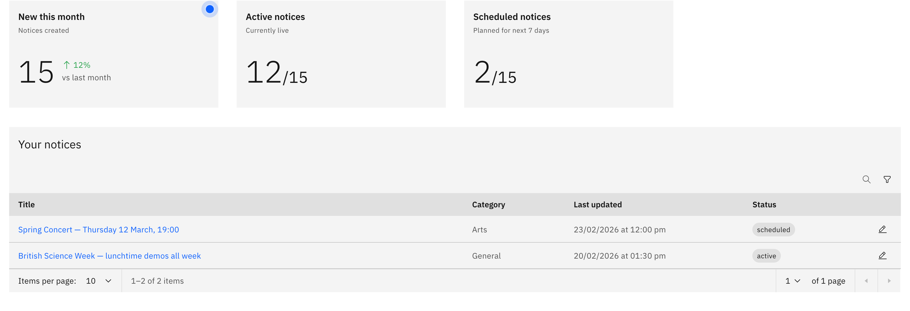

# Manage your notices

**Manage notices** has the table of notices you've created. Here, you can find, 
open, edit, and feature them.

> **Note:** If you can see **Manage notices**, you have editing access. You see
> the notices you created; school leaders also see everyone's.

1. Open Manage notices

   On the **Notices** board, click **Manage notices** in the top-right corner.

2. Find a notice

   The **stat tiles** double as filters. Click **Active notices** or **Scheduled
   notices** to filter the table. Click the tile again to clear the filter. You can
   also **Search** by the notice title or **Filter** by status and category. Click a
   notice's **title** to open its full details, or use a row's **edit icon** to
   change it.

   
