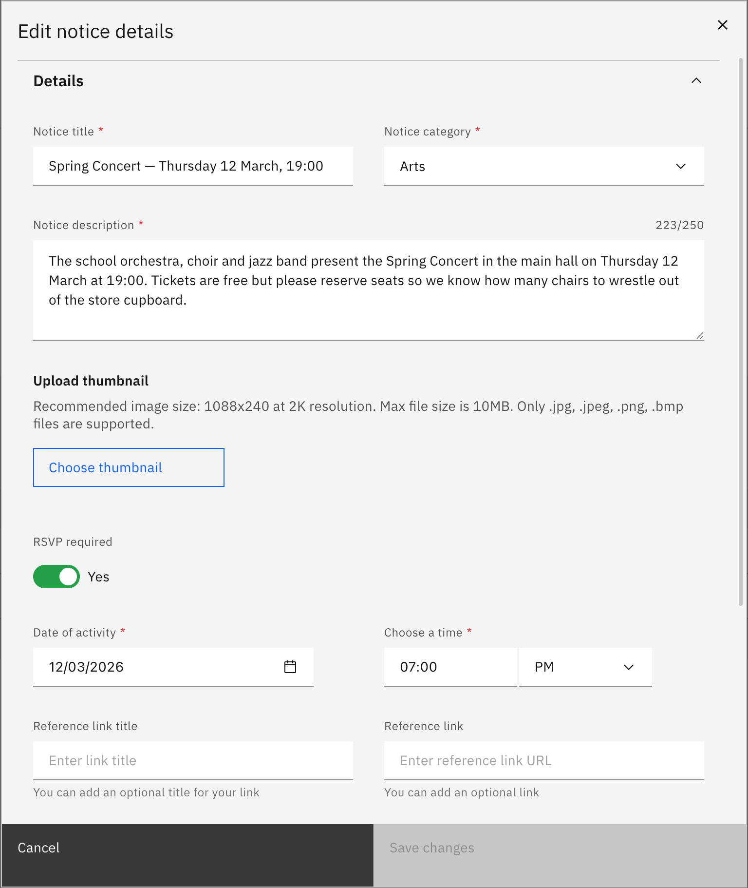

# Edit a notice

Update a notice you already created by changing its details, audience, or visibility.

> **Note:** You can only edit a notice that **you** created.

1. Open Manage notices

   In the **Notices** tab, click **Manage notices**.
   
2. Find your notice

   Click the **edit icon** in your notice's row in the **Your notices** list. Use the
   **Active notices** and **Scheduled notices** tiles to filter if needed.

3. Make changes and save

   Expand the section you want to change in **Edit notice details**—**Details**,
   **Audience type**, or **Visibility**—edit the fields, then click **Save changes**.

   > **Note:** **Save changes** only becomes active once you've changed something.

   
