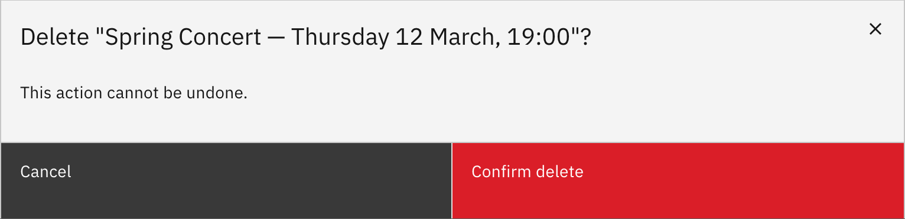

# Delete a notice

Remove a notice for good. Deletion is **permanent** — there's no undo.

1. Open the notice's details

   In **Manage notices**, click the notice's **title** to open its details window.

2. Delete it

   Click **Delete**, then **Confirm delete** on the warning.

   > **Note:** Deletion can't be undone. Only the staff member who created a notice
   > (or a school leader) can delete it.

   
