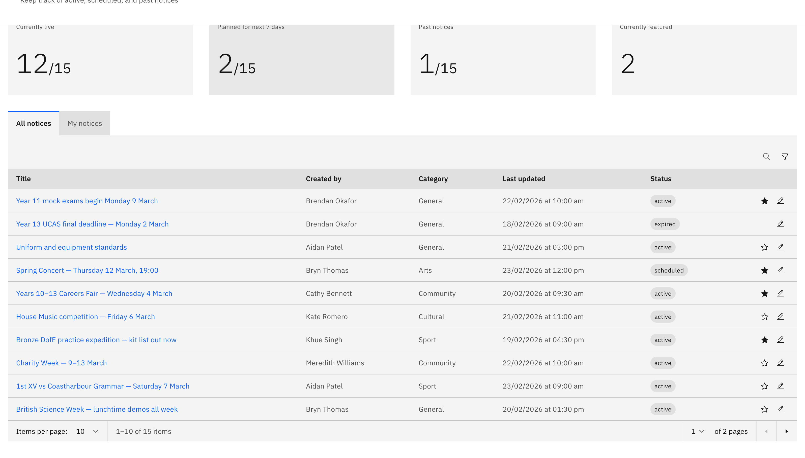

# Feature a notice

Featuring a notice highlights it in the **Featured** tab at the top of the board.

> **Note:** This is a **school leader** action — other staff don't see the feature
> controls.

1. Open Manage notices

   On the **Notices** board, click **Manage notices**, then find the notice with
   **Search** or **Filter**.

   

2. Feature it

   Click the **star icon** on the notice's row. A filled star means it's featured,
   and a **Featured updated** message confirms. Click the star again to unfeature.

   > **Note:** You can feature **Active** or **Scheduled** notices, not **Expired**
   > ones. There's a daily cap on featured notices — if it's reached, you'll see a
   > message that the notice publishes to the non-featured section instead.
