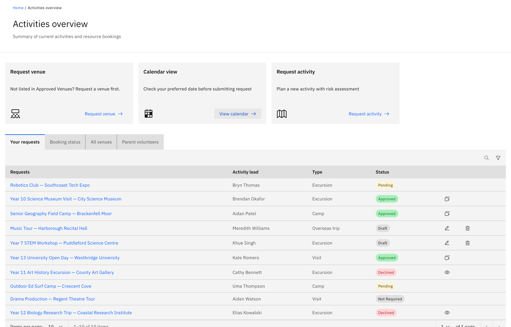

# Open the Activities overview

The Activities overview is the hub for off-class events — excursions, visits,
camps and overseas trips, plus the venues and resources they use. Three action
cards sit across the top, and a set of tabs sits below.

1. Open Activities

   Click **Activities** in the main navigation. Anyone with activity access can
   open it. The page opens on the action cards and the tabs below.

   

2. Use the action cards

   Three cards run across the top:
   - **Request venue** — "Not listed in Approved Venues? Request a venue first."
     Opens the venue request.
   - **Calendar view** — "Check your preferred date before submitting request."
     Opens the read-only activities calendar so you can pick a clear date.
   - **Request activity** — "Plan a new activity with risk assessment." Opens the
     activity-type picker (excursion, visit, camp or overseas trip).

3. Find the request queue

   The first tab is your request table. General staff see **Your requests** —
   only the requests you submitted. Activity coordinators and school leaders see
   **All requests** instead, plus a separate **My requests** tab for just their
   own submissions.

4. Browse the other tabs

   The remaining tabs are:
   - **Booking status** — resource bookings tied to activities.
   - **All venues** — approved and declined venues.
   - **All activities** — every approved activity org-wide. This tab only shows
     for activity coordinators and super admins.
   - **Parent volunteers** — parent helper sign-ups awaiting review.

   A notification can deep-link you straight to a specific tab — for example,
   opening the overview with **All venues** already in focus.
