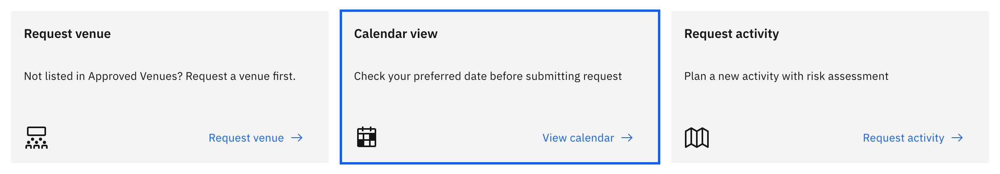
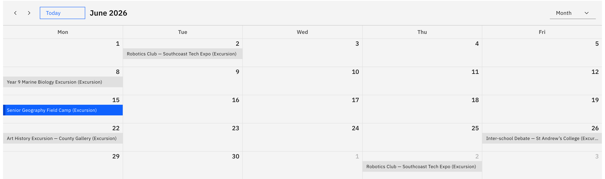

# View the activities calendar

The activities calendar is a month, week or day view of scheduled activities —
handy for checking a date is clear before you submit a request.

1. Open the calendar

   On the Activities overview, click the **Calendar view** card ("Check your
   preferred date before submitting request"), or open **Calendar view** from
   the navigation.

   

2. Choose how to view dates

   Switch between **Month**, **Week** and **Day**, and page forward or back
   through dates to find the period you need.

   

3. Read an activity

   Activities show as coloured blocks, with the colour set by activity type.
   **Click an event** to open a pop-up with its name, type, dates, and the year
   group, house or class it's for.

   The calendar is read-only — you can't create or edit an activity from it, it's
   only there to help you pick a clear date.
