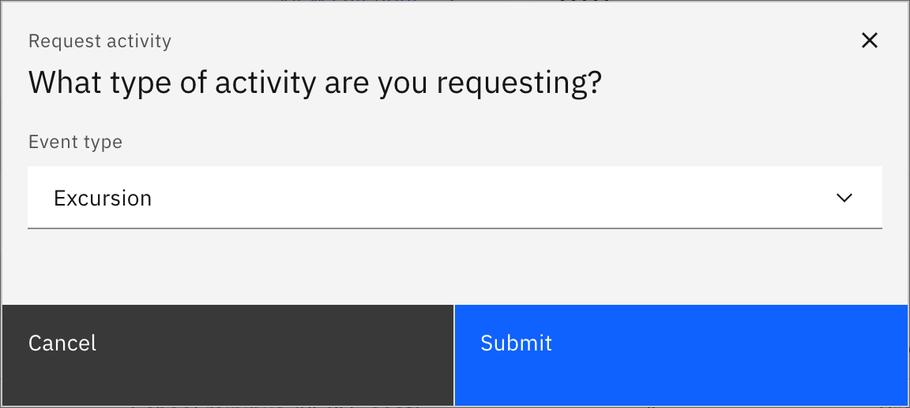
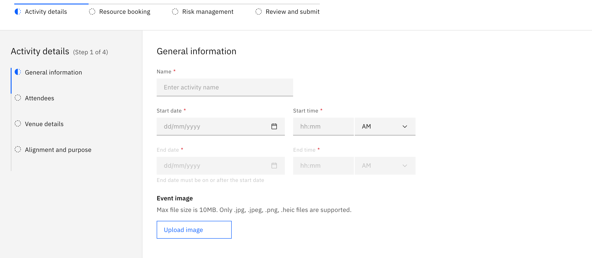

# Request an excursion

An excursion request is a four-step guided form that covers the activity, who's
going, the venue, and a risk assessment, then goes to an activity coordinator
for sign-off. Any staff member with activity access can create one. The step
indicator runs across the top of the page header, so you can also click it to
jump between steps.

1. Start the request

   On the **Activities** overview, click **Request activity**, choose
   **Excursion**, and click **Submit**. To check a date is clear first, use the
   **Calendar view** card before you start.

   

2. Fill in the activity details

   On **Activity details**, complete the four sections in the left-hand list.
   In **General information**, set the **Activity name**, **Start date** /
   **End date**, and **Start time** / **End time** (all required), and add an
   optional cover image. In **Attendees**, pick at least one **Student group**
   (by house, year group, class or roll group — required) and add any optional
   staffing, transport, cost or parent-volunteer details; parent consent is set
   to **Yes** automatically for excursions. In **Venue details**, choose an
   approved venue or enter one manually — manual phone, email and website
   entries must be valid. In **Alignment and purpose**, add the purpose,
   curriculum alignment and an optional schedule file. Click **Next**.

   

3. Book resources (optional)

   On **Resource booking**, optionally book what the activity needs from
   **Finance**, **Equipment**, **Transportation** and **Technology**. You can
   skip the step entirely, but once you start a booking row you must finish it —
   pick a resource category *and* a resource — or **Next** stays disabled.

4. Complete the risk management

   On **Risk management**, work through each category in turn — **Student
   lists**, **Activity based**, **Transport** and **Staff capacity** (log each
   risk and its mitigation, or mark the category "no risk"). In **Key contacts**
   add the lead teacher, principal, deputy, first-aid teacher and the **local
   emergency number** (required, and must be a valid phone number), plus the
   optional nearest hospital. Complete the **External provider** and **Requester
   clarification** confirmations, then click **Next**.

5. Review and submit

   On **Review and submit**, check the read-only summary. **Submit** stays
   disabled until every required field across all steps is valid; if anything is
   missing, an error message appears for each invalid field so you know exactly
   what to fix. Click **Submit** — a success message confirms it and you land
   back on the overview with the request showing as **Pending**.

   To stop partway, click **Save and exit** (enabled once you've entered an
   activity name) to keep your progress as a **Draft**. Leaving with unsaved
   changes prompts you first.
