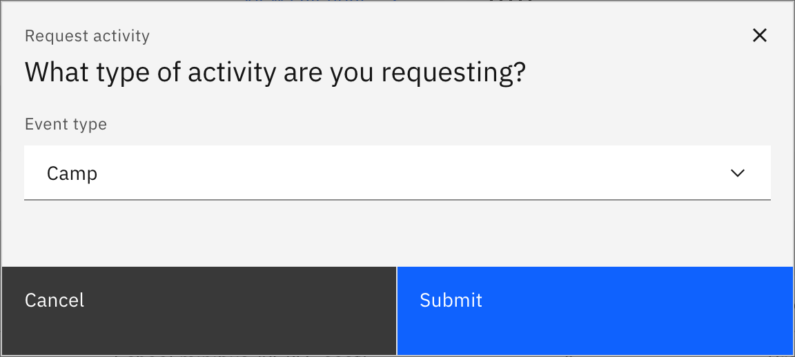

# Request a camp

A camp is one of the activity types you request from the **Activities** overview.
It uses the same four-step guided form as an excursion — **Activity details →
Resource booking → Risk management → Review and submit** — with a few camp-specific
fields (a meeting and pick-up time, multiple off-site locations, and lead staff).
Any staff member with activity access can submit a request; a coordinator then
approves it.

1. Start the request

   On the overview, click **Request activity**, choose **Camp**, and click
   **Submit**. (Click **Calendar view** first if you want to check your preferred
   dates are clear.)

   

2. Fill in the activity details

   In **Activity details**, work through the four sections in the left rail.
   Under **General information** add the **Activity name** and set the **meeting
   date & time** and **pick-up date & time** (camps capture both, not a single
   start/end time). Under **Attendees** pick the **Student groups** by house, year
   group, class or roll group, then add the **lead staff member** and a
   **second-in-charge** (with their role), and set **insurance** if it applies.

3. Add the location details

   In **Location details**, enter each off-site venue. A camp supports **multiple
   locations**, so add an entry per venue with its name, address, phone, email,
   website and contact. Choose from approved venues, or enter one manually — if a
   venue you need isn't approved yet, request it first.

4. Set alignment and purpose

   In **Alignment and purpose**, describe the camp's purpose and curriculum
   alignment, and upload the **schedule file** and the **packing-list file**.

5. Book resources (optional)

   In **Resource booking**, book anything the camp needs across **Finance**,
   **Equipment**, **Transportation**, and **Technology** — or skip the step. If
   you start a booking row you must finish it (pick a category and a resource);
   **Next** stays disabled until you do.

6. Complete the risk management

   In **Risk management**, fill in each category: **Student lists**, **Activity
   based**, **Transport**, and **Staff capacity** (log each risk and its
   mitigation, or mark the category "no risk"). Under **Key contacts** add the
   lead teacher, principal, deputy principal, first-aid teacher and the **local
   emergency number** (required, and must be a valid phone number). Complete the
   **External provider** and **Requester clarification** sections too.

7. Review and submit

   On **Review and submit**, check the summary and click **Submit**. **Submit**
   stays disabled until every required field across all steps is valid — if
   anything is missing, an error appears against each field so you know what to
   fix. A success message confirms the request, and you land back on the overview
   with the camp showing as **Pending**.

   To stop partway, click **Save and exit** (enabled once you've entered an
   activity name) to keep it as a **Draft** you can finish later.
