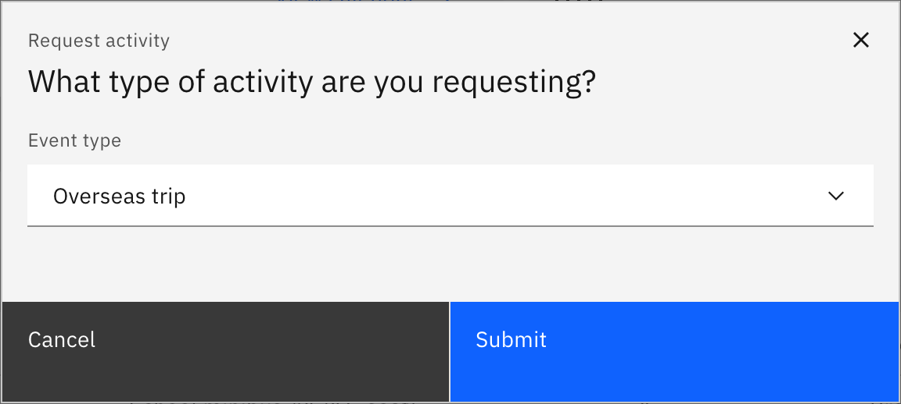
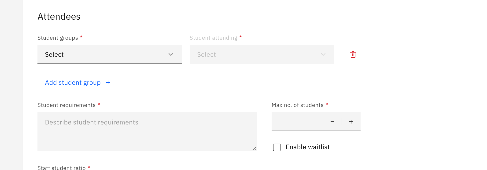

# Request an overseas trip

An overseas trip is a four-step request — **Activity details → Resource booking →
Risk management → Review and submit** — and it carries the most controls of any
activity type. Any staff member with activity access can submit one; an activity
coordinator approves it afterwards.

1. Start the request

   On the **Activities** overview, click **Request activity**, choose **Overseas
   trip**, and click **Submit**. The four steps run across the top of the page
   header; use **Next** / **Back** to move, or the step indicator to jump.

   

2. Fill in the activity details

   Enter the **Activity name**, the **Start date** / **End date** and **Start
   time** / **End time**, and optionally a cover image. Under **Attendees**, pick
   your **Student groups** (by house, year group, class or roll group) and name
   the **lead** staff member and a **second-in-charge**. Set the **insurance**
   option, and set the **Max no. of students** cap and **Enable waitlist** —
   overseas trips are the only activity type with these.

   Overseas trips support **multiple off-site venue entries**, so add each venue
   (name, address, phone, email, website and contact). Finish the step with the
   activity's purpose and curriculum alignment, plus a **schedule file** and a
   **packing-list file**.

   

3. Book resources (optional)

   Book anything the trip needs under **Finance**, **Equipment**,
   **Transportation** and **Technology**. You can skip this step entirely — but
   once you start a booking row you must finish it (pick a resource category *and*
   a resource), or **Next** stays disabled.

4. Complete the risk assessment

   Work through each category — **Student lists**, **Activity based**,
   **Transport** and **Staff capacity** — logging risks and their mitigations, or
   marking a category "no risk". Under **Key contacts**, the **local emergency
   number is required** for an overseas trip. Then confirm the **External
   provider** checks and the **Requester clarification** items.

5. Review and submit

   Step four is a read-only summary of everything you entered. Click **Submit**.
   A success message confirms it and you land back on the overview with the
   request showing as **Pending**.

   **Submit** stays disabled until every required field across all steps is valid.
   If anything is missing, an error appears for each invalid field so you know
   exactly what to fix.

> **Note:** To leave before submitting, click **Save and exit** — it saves your
> progress as a **Draft** and is enabled as soon as you've entered an activity
> name. If you try to leave with unsaved changes, an unsaved-changes prompt
> appears first.
