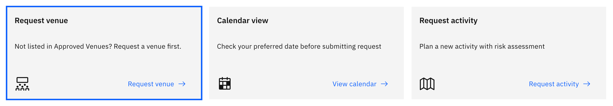

# Request a venue

When the venue you need isn't already an approved venue, you request it first.
This is its own three-step flow, separate from the activity request, and any
member of staff can start it.

1. Open the venue request

   On the **Activities** overview, click the **Request venue** card ("Not listed
   in Approved Venues? Request a venue first."). You can also start it from inside
   an activity request when you are picking a venue. The form runs in three steps —
   **Venue details**, **Risk management**, **Review and submit** — shown in the
   left rail.

   

2. Fill in the venue details

   In **Basic information**, give the **Reason for request** and the **Venue
   name**, **Address**, **Telephone**, and **Email** (all required); a **Website**
   is optional but must be a valid `http://` or `https://` address if you enter
   one. In **Contacts**, add the venue's key **Contact name**, **Contact email**,
   and **Position**. In **Students**, set the **Relevant learning area**, **Year
   groups**, and **Cost to students** with its **Currency**.

3. Attach the required documents

   Still on **Venue details**, the **Attach documents** section needs both a
   **Public-liability insurance** file and an **emergency plan** file — both are
   required. You can add any number of additional documents, which are optional.

4. Complete the risk management step

   On **Risk management**, work through the venue risk assessment for each
   category — **Student list**, **Activity based**, **Transport**, and **Staff
   capacity** — logging the risks and their mitigations, or marking a category as
   no risk. Then complete the **Key contacts** and **External provider**
   confirmations and the **Medical support** section (venue first-aid
   qualification, first-aid kit, and defibrillator).

5. Review and submit

   On **Review and submit**, check the summary, which flags anything still
   missing. **Submit** stays disabled until the venue details, contacts, students,
   both required documents, every risk category, and the key-contact and
   external-provider confirmations are complete. Click **Submit**: a success
   message confirms the venue request was created and you return to the overview.

   At any point you can click **Save and exit** to keep a **Draft** (available
   once you have entered a venue name); if you try to leave with unsaved changes,
   the form prompts you first.
