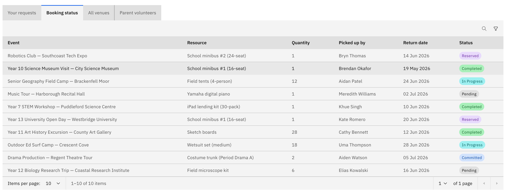

# Check resource bookings

The **Booking status** tab on the **Activities** overview lists the equipment and
resources booked against activities, so you can see what's reserved, who has it and
when it's due back.

1. Open Booking status

   On the **Activities** overview, open the **Booking status** tab. Any staff member
   with activity access can view it.

   

2. Read the table

   Each row shows the booking's **Event**, the **Resource** booked, the **Quantity**,
   who it was **Picked up by**, its **Return date** and its **Status**.

3. Find a booking

   **Search** by event name and **filter** by booking status to narrow the list down
   to the bookings you care about.

This tab is read-only — it shows the state of each booking but doesn't let you change
one. Resources are booked from within an activity request, on its **Resource booking**
step.
