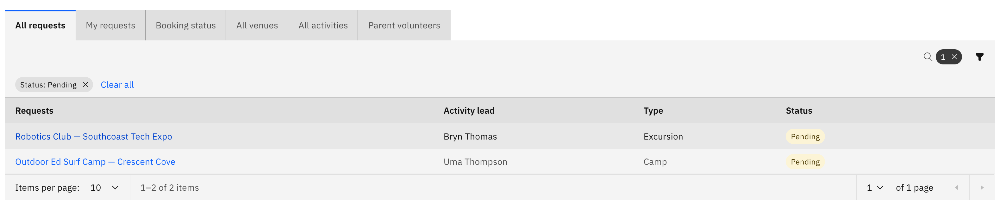

# Review a request

As an activity coordinator you act on the requests staff submit — approving
them, declining them, or sending them back for more information. The request
opens in the same layout it was submitted in, with the decision controls in the
header.

1. Open a Pending request

   On the **Activities** overview, open the **All requests** tab, find a
   **Pending** request and click **Review** (the row action). The **Review**
   action only appears on Pending requests and only for coordinators.

   

2. Read the submitted details

   The request opens read-only, showing everything the requester entered — the
   activity, participants, venue and risk assessment. Scroll through to check
   it before you decide.

3. Choose a decision

   The decision controls sit in the header:

   - **Approve** — signs the request off. A success message confirms it, the
     request becomes **Approved**, and you return to the queue.
   - **Decline** — opens a notes box. Enter why and confirm; the request becomes
     **Rejected** and the requester is notified.
   - **Request more info** — opens a notes box. Enter what's needed and confirm;
     the request moves to **More info** for the requester to update and resubmit.

   **Decline** and **Request more info** both require notes — the requester reads
   them back via **View review notes** on the request row.

   

4. Edit on behalf if needed

   To fix something yourself rather than send it back, use **Edit on behalf**.
   This opens the request in its editable form; **Back to approval** returns you
   to the decision step without saving.

5. Review a venue request the same way

   A **venue** request uses the same **Approve** / **Decline** / **Request more
   info** controls in its own review.

> **Note:** if the requested venue clashes with another approved event,
> **Approve** is disabled and a **Venue conflict detected** pop-up names the
> conflicting event. You can't approve until the clash is resolved.
