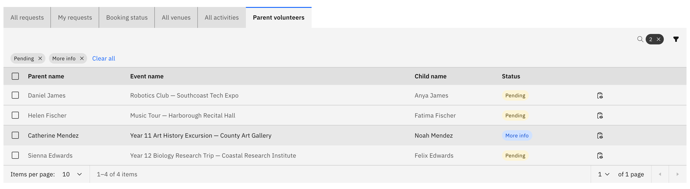
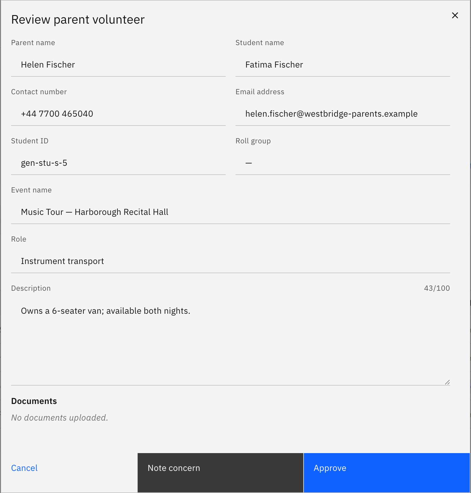

# Review parent volunteers

Parents can sign up to help on an activity, and their sign-ups land here for an
approver to action. Reviewing and approving parent volunteers is **approver-only**
(activity coordinator, school leader, or super admin); general staff can see the
list but not the approve or decline controls.

1. Open the parent volunteers list

   On the **Activities** overview, open **Parent volunteers**. The tab opens
   filtered to **Pending** / **More info**, so the sign-ups waiting on you appear
   first.

   

2. Read the table

   Each row shows the volunteer's **parent name**, the **event**, the **child**,
   their **contact details**, the **role** they offered, and a **Status** tag.

3. Review a volunteer

   Click **Review** on a row to open the detail modal, where you can read the
   volunteer's submitted documents before you decide.

   

4. Approve or decline

   In the modal, click **Approve** or **Decline**. To action several at once,
   select their rows and use the **batch Approve** / **Decline** actions.

5. Remove an approved volunteer

   To withdraw someone you have already signed off, click **Remove** on their row.
