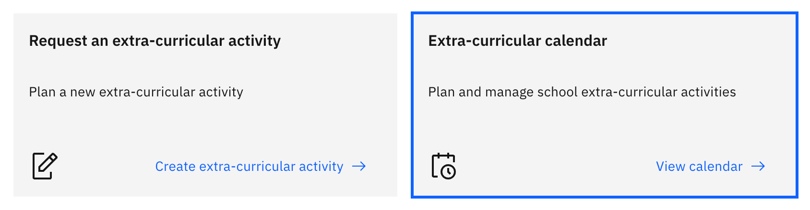
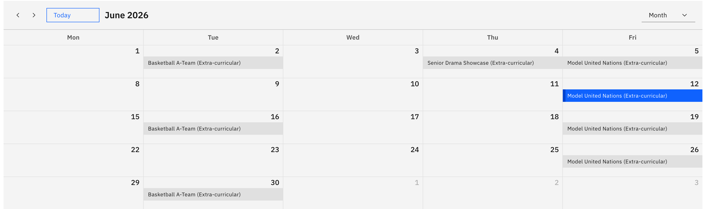

# View the extra-curricular calendar

The extra-curricular calendar shows the school's scheduled clubs and teams across
a month or week, so you can plan around them. Anyone with extra-curricular access
can open it.

1. Open the calendar

   Click **Extra curricular** in the main navigation, then click **View calendar**
   on the action card at the top of the hub. The calendar opens in the canvas
   pane.

   

2. Choose the view and dates

   Switch between **Month** and **Week**, and page through the dates to find the
   period you want. The next upcoming activity is highlighted for you
   automatically.

   

3. Read the events

   Each event is colour-coded by its activity type. Click an event to open a small
   details pop-up showing the activity name, type, start and end, and its year
   group, house or class.
