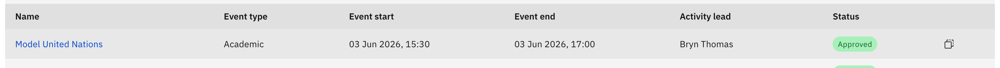

# Duplicate (replicate) an activity

Replicate reuses an approved activity as the starting point for a new request —
handy for re-running a club or team each term without rebuilding the whole plan.
Any staff member can do this from their own requests.

1. Find an approved activity

   On the **Extra curricular** hub, open the **All requests** tab (or **Your
   requests**) and find an **Approved** row, or use the **Supervising
   activities** tab, which lists approved activities. The **Replicate**
   (duplicate) icon is the row action on Approved rows.

   

2. Open the copy

   Click the **Replicate** icon. The four-step create flow opens pre-filled from
   that activity — venue, attendees, costs, resources, and risk content are all
   carried over.

   > **Note:** Replicate creates a **new** request and never edits the original.
   > The dates and the whole registration window are cleared, so you must enter
   > current ones before you can submit.

3. Adjust and submit

   Re-enter the **Event start/end dates and times** and the **Registration
   start/end** window, change anything else the new run needs, then work to
   **Step 4 — Review and submit** and click **Submit**. It goes in as a brand-new
   request for approval.
