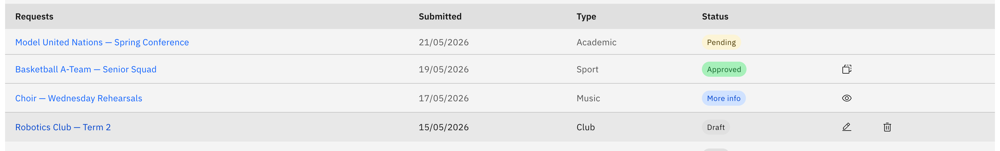

# Edit or delete your request

Edit and Delete are only available while a request is still **New** or **Draft** — before it's submitted. Once a request is **Pending**, **Approved**, or **Declined**, you act on it through Review, View notes, or Duplicate instead.

1. Find your draft

   On the **Extra curricular** hub, open the **All requests** tab (coordinators and leaders) or **Your requests** tab (other staff). The **Status** column shows a coloured tag — look for a **New** or **Draft** request. Use the search box or the **Status** filter to narrow the list.

   

2. Edit it

   Click the **Edit (pencil)** action on the row. The request reopens in the four-step create flow (**Activity details → Resource booking → Risk management → Review and submit**), pre-filled with everything you'd entered. Make your changes, then **Submit** on the final step (or **Save and exit** to keep it as a draft for later).

3. Delete it

   Click the **Delete (bin)** action on the row, then confirm on the prompt. A success message appears and the request leaves the list.

   > **Note:** Deleting a request is permanent — there's no undo, and a deleted draft can't be recovered.
