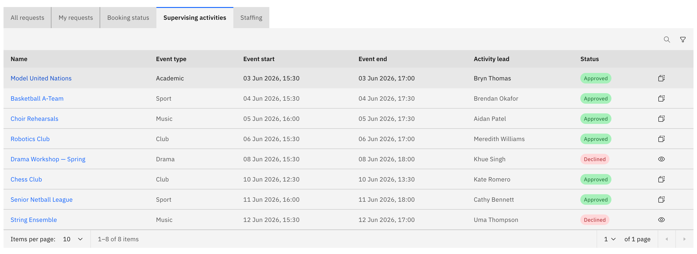
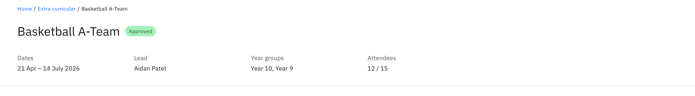
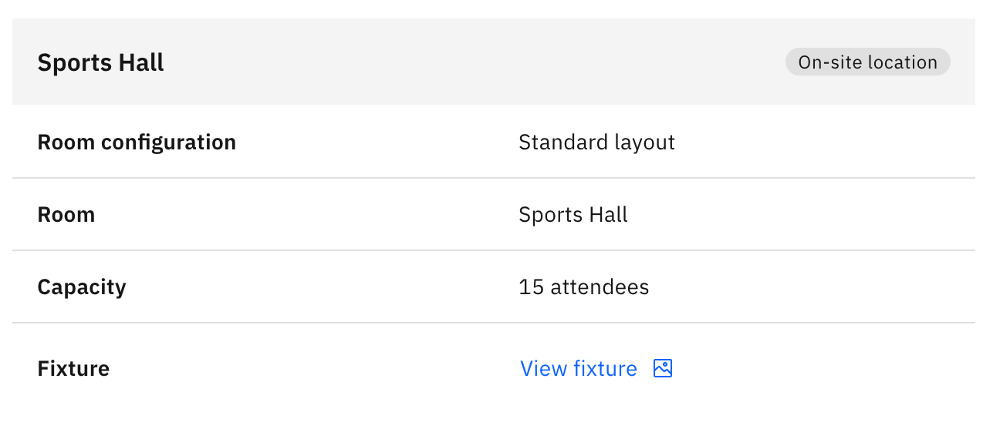
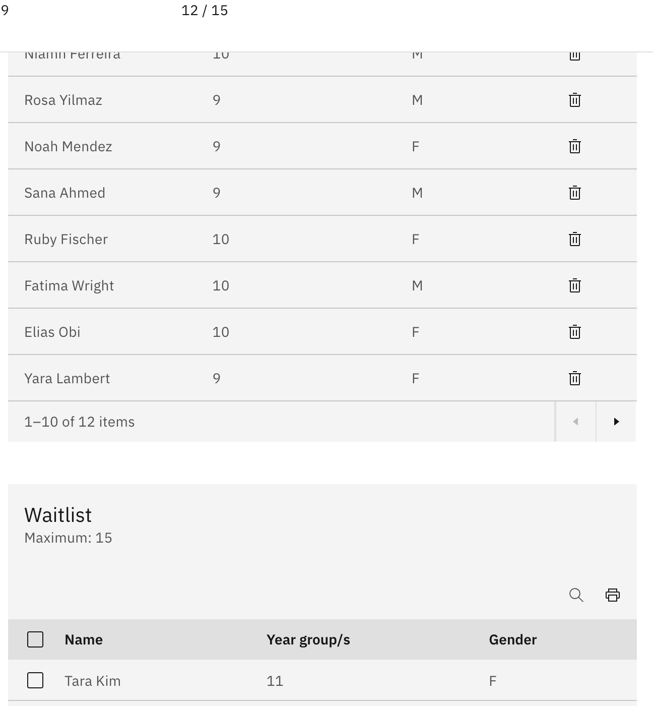

# View an approved activity's details

The details page is the management page for a live, approved activity.

1. Open the activity

   From the **Supervising activities** tab, click an activity **name**. The
   details page opens. This tab lists only **Approved** and **Rejected**
   activities.

   

2. Read the header

   The header shows the activity **name**, an **approval status** tag, and an
   attributes row: **Dates**, **Lead**, **Year groups**, and **Attendees**. The
   **Attendees** value is shown as registered out of maximum, for example 18 / 30.

   

3. Check the venue details

   The left column's **Venue details** shows the location type, venue or room,
   room configuration, capacity, address, and contact details. If a fixtures file
   was attached, a **View fixture** link appears here.

   

4. Review the staffing

   The **Staffing** panel lists assigned staff with their role, phone, and email.
   External members show a **consent** link.

5. See the participants and waitlist

   **Registered participants** lists everyone enrolled, and **Waitlist** lists
   anyone waiting for a place. Each table shows **Name**, **Year group/s**, and
   **Gender**, with the maximum places labelled on the table.

   

6. Find post-event feedback

   After the activity's end date passes, a **post-event feedback** section also
   appears on the page.
