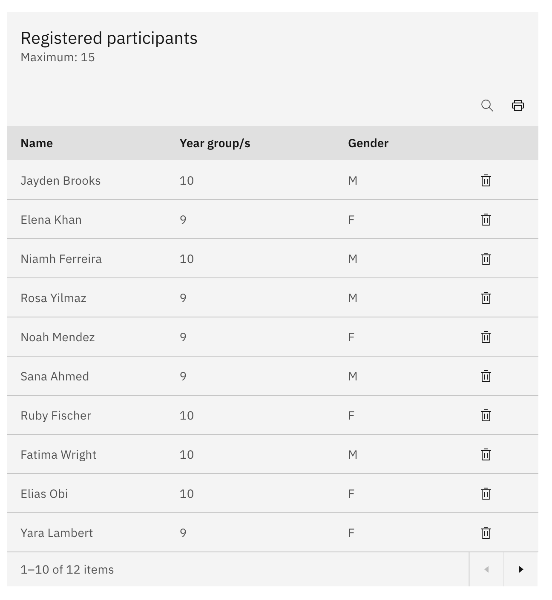

# Manage registered participants

Once an activity is approved, you manage everyone enrolled in it on the activity's
own **details** page.

1. Open the participants table

   Open the approved activity's **details** page and find the **Registered
   participants** table. The heading shows the place limit as **Maximum** (for
   example, **Maximum: 20**), and each row lists the student's **Name**, **Year
   group/s**, and **Gender**.

   

2. Find a participant

   Use **Search** to filter the table by name, year group, or gender.

3. Remove a participant

   Click the **bin** icon on the student's row, then confirm in the **Remove
   participant** dialog. A success message confirms the student has been removed.

   > **Note:** Removing a participant takes them off the activity straight away.
   > To re-enrol them, they have to register again (or be approved from the
   > waitlist).
