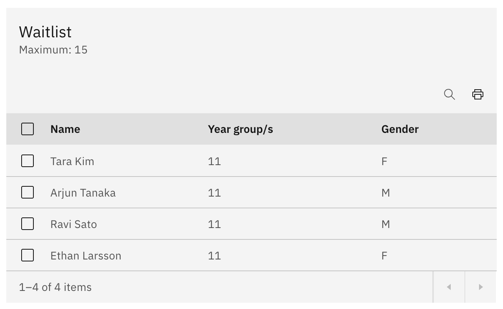
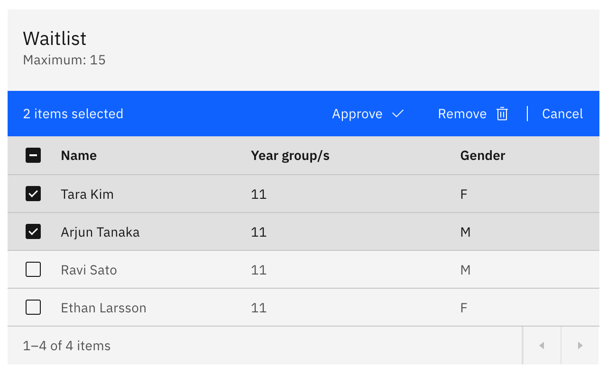

# Manage the waitlist

When an activity has a waitlist turned on, students beyond the maximum join it
instead of being turned away. From the activity's details page you bring those
students into the activity or take them off the list.

1. Open the Waitlist table

   On the approved activity's **details** page, find the **Waitlist** table. It
   only appears when the activity has a waitlist. The heading shows the
   **Maximum** number of students, and the columns are **Name**,
   **Year group/s**, and **Gender**.

   

2. Select the students you want to act on

   **Tick** one or more rows. As soon as a row is selected, a batch action bar
   appears with **Approve** and **Remove**. There are no per-row buttons —
   selecting rows is how you choose who to act on.

   

3. Approve or remove them

   Click **Approve** to move the selected students off the waitlist and into the
   activity, or **Remove** to take them off the list entirely. **Remove** asks
   you to confirm and can clear several students at once. A success message
   confirms each action.
