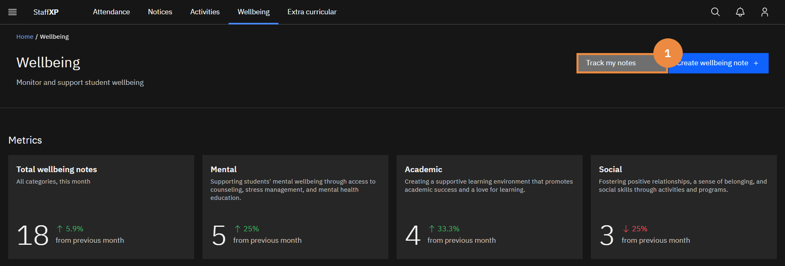
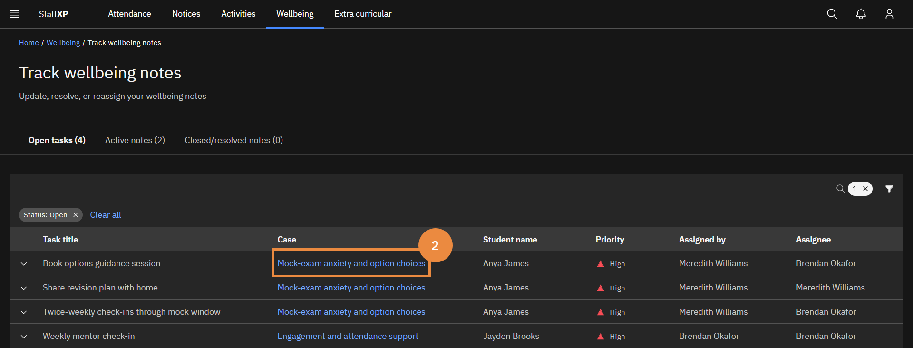
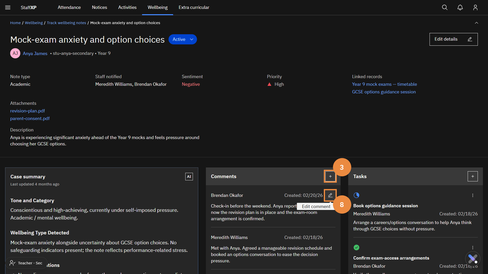
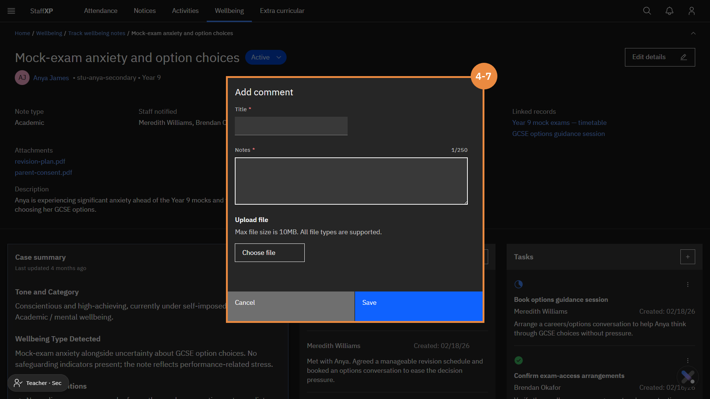

# Wellbeing

Student wellbeing encompasses all aspects of a student's life, including happiness and health, academic challenges, and social relationships at home and at school. The wellbeing landing page is an area to monitor and support student wellbeing.

---

## Wellbeing Case Management

### Create a wellbeing note — manual

1. Click on the **Wellbeing** tab to open the Wellbeing landing page.
2. On the left tile below the heading, click **Create wellbeing note →**.
3. Fill in the required fields (indicated by an asterisk *) in the pop-up window.
   - Add a **Title** for the wellbeing note.
   - Enter the **Student name** (you can type or select the name from the dropdown menu).
   - Add a **Description**.
   - Select a **Note type** (choose one of the seven subcategories).
   - Under **Sentiment**, identify if the note is **Positive** or **Negative**.
   - Identify the **Priority** for action (Low, Medium, High or Critical).
  
> **Note:** *The student ID and year group will automatically populate.*

4. Attach photos if required.
5. If this wellbeing note is related to an existing note, you can connect the notes in **Linked note** by typing the start of the heading of the note you wish to link to, and the content will autofill.
6. In the **Notify staff member** text, start typing a staff member's name to share the wellbeing note with other staff members.

> **Note:** *A dropdown will open so you can select the staff member without typing the full name.*

7. Click the blue square outline with a **+** in the centre to add more staff members.
8. Select if parents need to be notified of this wellbeing note.
9. Select **Publish note**.

> **Note:** *The note can only be published if all the required fields are completed.*

### Upload supporting documents

1. Click on the **Wellbeing** tab to open the Wellbeing landing page.
2. On the left tile below the heading, click **Create wellbeing note →**.
3. Fill in the required fields (indicated by an asterisk *) in the pop-up window.
4. Below the **Upload optional photos or documents** heading, click **Choose file**.

> **Note:** *The total maximum file size is 10MB.*

5. A **File folder** will pop up, select the relevant document.
6. Select **Open**. The file will automatically upload.
7. You can add as many files as long as you remain below the maximum file size.
8. To remove a file, press the X on the right of the file heading.
9. Save by clicking **Publish note**.

> **Note:** *The note can only be published if all the required fields are completed.*

### Create & assign task from note

1. Navigate to the **Wellbeing** landing page from the **Navigation bar**.
2. Click **Track and resolve notes →** on the right tile below the heading.
3. Select the relevant **Wellbeing note** from the **Active notes** tab.
4. Select the blue square with a + sign on the **Tasks** tile on the right.
5. A pop-up window will open up. Complete the required fields marked with an asterisk (*).
     - Add a **Title**.
     - Select an **Assignee**.
     - Add **Notes** to describe the task.
6. Click **Save**.

> **Note:** *The task will automatically appear in the tasks tile.*

7. Edit the task by clicking on the **pencil icon**. In the pop-up window, there is a **Status bar** to update and monitor the task status.

### Create and submit a note

### Submit and pop up

1. After you submit a **wellbeing note**, you will get a pop-up notification at the top right of the window confirming the success of the note submission.
2. Changing the status of a note will also result in a pop-up notification.

> **Note:** *If a linked member of staff makes any edits to the note, the changes will appear as notifications in the dropdown below the **Bell icon** or in the **Notification centre**.*

### Auto-create case

When you successfully create a **wellbeing note**, it automatically opens a case. The steps below outline how to find **Active notes**.

1. In the **Wellbeing** tab, select **Track and resolve notes →** on the right tile below the heading.
2. Below **Case Title** is a list of all the **Active notes**.
3. Click the tab subheading **Closed/resolved notes** to view previous or currently inactive notes.

### Link related cases

In situations where more than one student is involved in a wellbeing case, or more relevant notes are required, it is possible to connect a new **Wellbeing note** to an existing note. Check the title of the existing note(s) beforehand for linking.

1. Navigate to the **Wellbeing** landing page.
2. Click **Create wellbeing note →** on the left tile.
3. Complete the mandatory fields in the pop-up window.
4. In the **Linked note** field, begin typing the heading of the relevant wellbeing note. There is a dropdown that will share all the notes containing the same words.
5. Select the correct note; it is now linked.
6. To add more linked notes, press the blue square with the white **+**.
7. To remove an empty linked note space, click on the red waste bin icon.

> **Note:** *To unlink a linked note, press the **X** at the end of the search field.*

### View details of a wellbeing case

1. Navigate to the **Wellbeing** landing page.
2. Click **Track and resolve notes →** on the tile on the right.
3. In the **Active notes** tab, find and select the relevant wellbeing note.
4. The note will automatically open, where you can view:
      - Student name and number
      - Note description
      - Note type
      - Sentiment
      - Staff Notified
5. Below the area is an AI-generated summary of the note and details.
6. There are also tiles for **Comment timeline** and follow-up **Tasks** related to the note.

### Track & resolve wellbeing notes

1. Navigate to the **Wellbeing** landing page.
2. Click **Track and resolve notes →** on the tile on the right.
3. In the **Active notes** tab, find and select the relevant wellbeing note.

> **Note:** *Confirm that there are no outstanding tasks or follow-up required on the wellbeing note. Once a note is resolved or closed, it cannot be opened again. A separate note will be needed.*

4. After selecting the note, the **Update status** box will become blue. Click the **Update status** box.
5. A pop-up will appear. From the dropdown, you can select **Active**, **Resolved** or **Cancelled**.
6. Click **submit**, the status will automatically update.

### Update existing note

As the wellbeing situation evolves, or more information becomes available, it is possible to add supplementary comments to the existing **wellbeing note**.

1. Navigate to the relevant note from the **Wellbeing** landing page ▸ **Track my notes**.
2. Select the relevant note.
3. In the middle **Comments** tile, click the **+**.
4. Fill in the fields for the comment.
6. Upload supporting documents if required.
7. Click **Save**.
7. The note will appear in the **Comments** tile.
8. To edit an existing comment, press the **pencil icon** to edit the note.

### Update existing wellbeing task

For each **Wellbeing** note, you can assign follow-up tasks for yourself or other members of staff. One member of staff can be assigned per task.

1. Navigate to the relevant note from the **Wellbeing** landing page ▸ **Track and resolve notes →**.
2. Select the relevant note.
3. Click the blue square with the white **+** on the **Tasks** tile on the right of the screen.
4. A pop-up window will open to **Add new task**.
5. Complete the fields.
      - Add a **Title**.
      - Select an **Assignee**. Start typing the name, and all the names, including those characters, will appear in a dropdown.
      - Add **Notes**.
6. Click **Save**. The save button will only be enabled when all fields are completed.
7. The task will appear in the **Tasks** tile on the right.

> **Note:** *After successfully saving, a pop-up message will appear in the top-right corner confirming the addition of the task.*

8. To edit the task or update the status, click on the **Pencil icon**.
9. Another pop-up window will open. This window will have an additional field, **Status**.
10. Update the task status by selecting either **Open**, **Completed** or **Canceled**.
11. Click **Save**. Another pop-up message will confirm successful saving.

> **Note:** *Changing the status to **Completed** or **Canceled** will permanently remove the task from the **Tasks** tile.*

### View AI summary in a case

1. Navigate to the **Wellbeing** landing page.
2. Click **Track and resolve notes →** on the tile on the right.
3. In the **Active notes** tab, find and select the relevant wellbeing note.
4. The page displays a description and details of the wellbeing note.
5. Below, with a grey background, on the left, there is an AI-generated **Summary** of the wellbeing note and details.

 > **Note:** *The text box expands to adjust to the amount of text present, there is no need to click the information box.*

---
