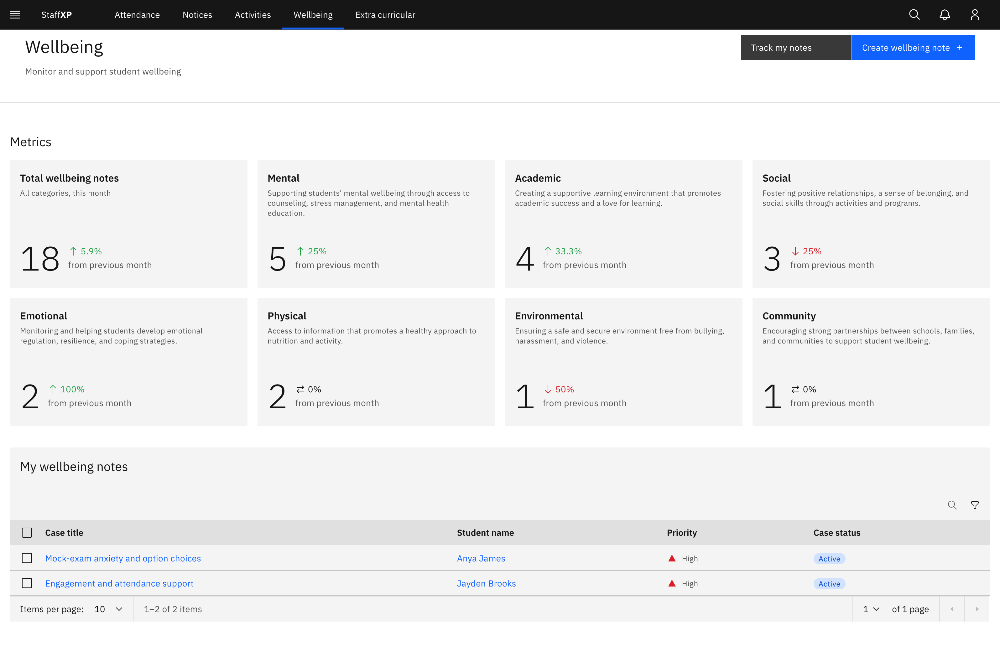

# View the Wellbeing landing page

The Wellbeing landing page is the pastoral overview: a metrics strip across the
top, then a table of your wellbeing notes below.

1. Open Wellbeing

   Click **Wellbeing** in the main navigation. The page opens on the metrics
   strip and your notes table.

   

2. Read the metrics strip

   The **Metrics** cards show this month's figures with a "from previous month"
   change. **Total wellbeing notes** combines every category, and there is one
   card per wellbeing category (Mental, Academic, Social, Emotional, Physical,
   Environmental, Community) with that month's count. The cards are read-only
   summary figures, not clickable filters.

3. Browse the notes table

   Below the strip, the table lists your active notes with **Case title**,
   **Student name**, **Priority** and **Case status**. Search the table, filter
   by priority, and page through the results. The heading reads
   **All wellbeing notes** if you have view-all permission (leaders and
   coordinators); otherwise it reads **My wellbeing notes** and shows only notes
   you created or were assigned.

4. Open a case or a student

   Click a **Case title** to open that case's detail page. Click a
   **Student name** to open the student's profile. **Case status** is shown as a
   coloured tag: **Active** (blue) is an open case being worked, **Resolved**
   (green) is finished and read-only, and **Cancelled** (grey) is closed without
   resolution and read-only. **Priority** is one of Low, Medium, High or
   Critical.
