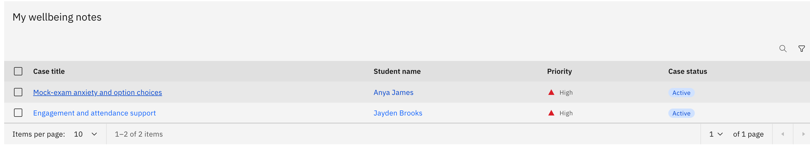
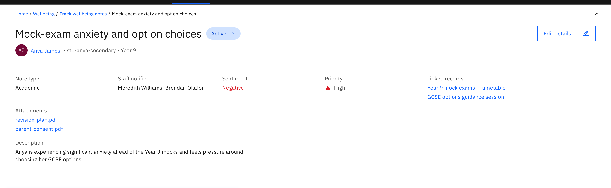
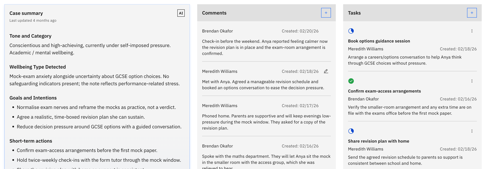

# View a wellbeing case

The case detail page is the full workspace for one wellbeing note.

1. Open the case

   Click a **Case title** in any wellbeing table. The case detail page opens.

   

2. Read the header

   The header shows the **case title**, an interactive **status pill** (Active,
   Resolved, or Cancelled), the **student** (avatar, name, ID, year group), and
   attribute chips: **Note type**, **Staff notified**, **Sentiment**, **Priority**,
   **Linked records**, and **Attachments**. Use the chevron button to collapse or
   expand these details.

   The **Attachments** and **Linked records** in the header are clickable: images
   open in a preview, and other files download.

   

3. Work the case body

   The body has three areas. **Summary** is an AI-generated case summary with a
   "last updated" label. **Comments** is the timeline of follow-up comments.
   **Tasks** lists the follow-up tasks for the case.

   

4. Edit the details

   Writers see an **Edit details** action in the header to change the note. A
   resolved or cancelled case is read-only: an info banner appears and the **Edit
   details**, **Add comment**, and **Add task** controls stay hidden or disabled
   until you reopen the case from the status menu.
