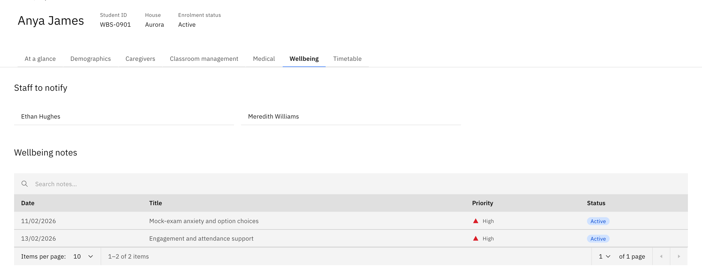

# See a student's wellbeing notes

The **Wellbeing** tab on a student's profile is a read-only roll-up of every
wellbeing note raised for that one student.

1. Open the Wellbeing tab

   Go to the student's profile and select the **Wellbeing** tab.

   

2. Check who gets notified

   **Staff to notify** lists the student's escalation contacts.

3. Browse the notes

   **Wellbeing notes** is a table of every note raised for the student, showing
   **Date**, **Title**, **Priority** and **Status**. Search the list and page
   through the results. This tab is read-only — there are no create or edit
   controls here, so to raise a new note or change an existing one, work from the
   **Wellbeing** area itself.
