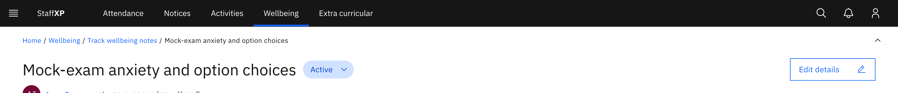
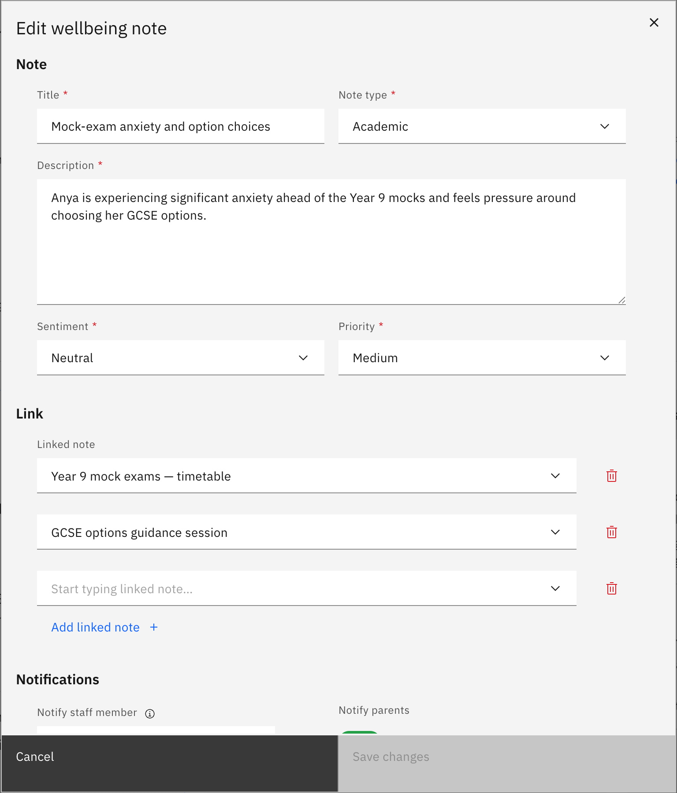

# Edit a wellbeing note

Change a note's content after it's created. The fields are the same as when you created it, pre-filled with the current values.

> **Note:** Editing a note needs **write** access (pastoral / student-support staff or leaders). **Edit details** does not appear for read-only staff.

1. Open the case and start editing

   Click the **Case title** to open the case detail page, then click **Edit details** in the header. **Edit details** is disabled while a case is **resolved** or **cancelled** — reopen the case (set it back to Active) before you can edit it.

   

2. Change the fields

   In the **Edit wellbeing note** modal, update the **Title**, **Note type**, **Sentiment**, **Priority**, or **Description**. You can also change **Notify parents** / staff, linked notes, or attachments. The **Subject** (student) section is hidden, so you cannot reassign a note to a different student — the student is fixed when the note is created.

   

3. Save your changes

   Click **Save**. A success toast confirms the update. If you close the modal with unsaved changes, a warning asks you to confirm before discarding them.
