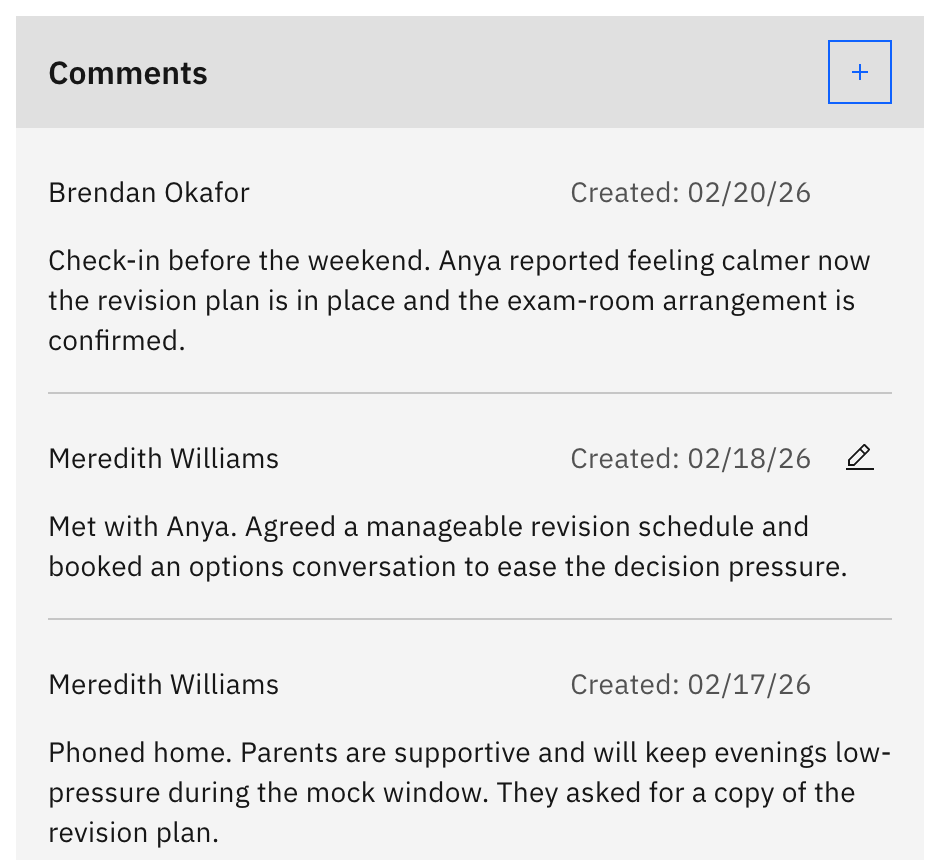
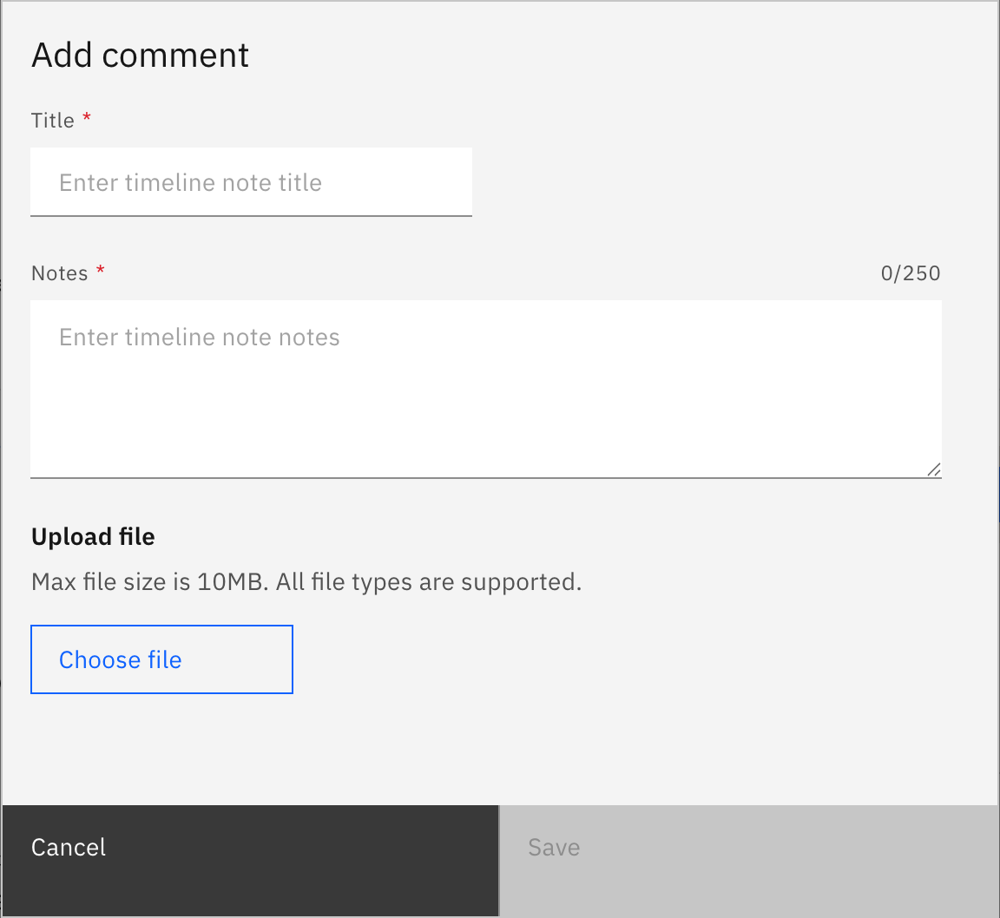

# Add a comment to a case

Comments are the follow-up timeline on a wellbeing case. Use them to log an
update, an action you took, or anything worth recording against the case.

1. Open the comment form

   On the case detail page, in the **Comments** tile, click the **+** (Add
   comment).

   

   > **Note:** The **+** only appears for staff with wellbeing **write** access,
   > and it is hidden once a case is **resolved** or **cancelled**. Reopen the
   > case to comment again.

2. Write the comment

   In **Add comment**, enter a **Title** (up to 100 characters) and the **Notes**
   text (up to 250 characters). Optionally attach one supporting file (max 10 MB,
   any file type).

   

3. Save it

   Click **Save**. The comment appears at the top of the timeline, which shows
   newest-first. Once there are more than five comments, **Show older comments**
   reveals the rest. To change a comment later, use the **pencil icon** on that
   comment.
