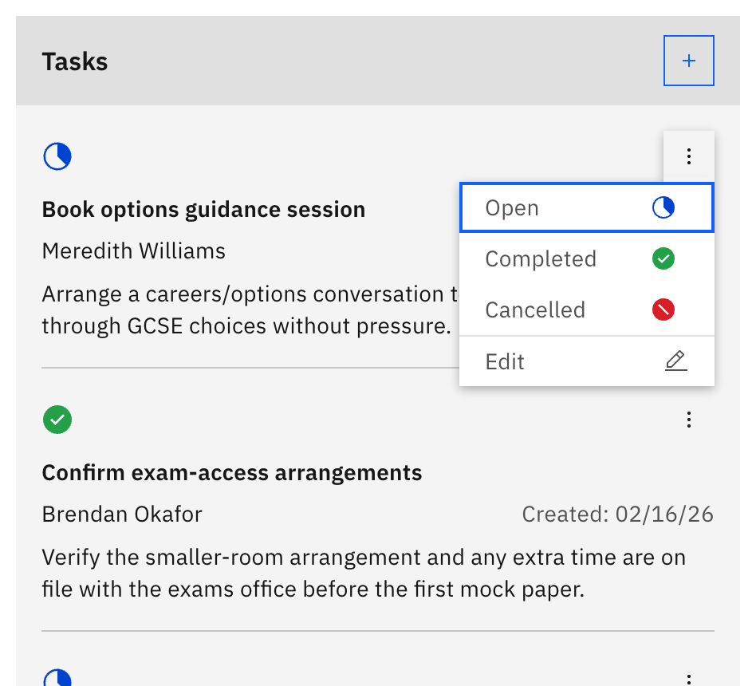
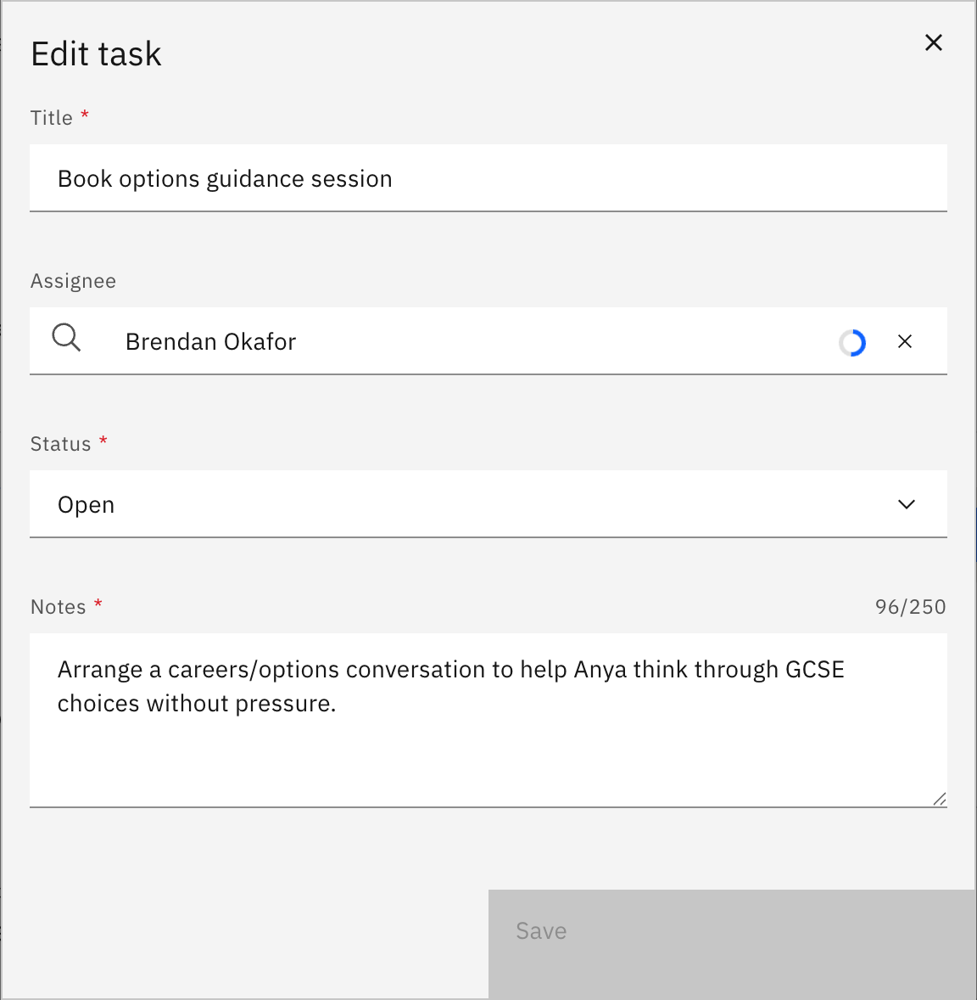

# Edit or update a task

Change a task's details, reassign it to a colleague, or move it through its statuses.

> **Note:** Editing tasks needs **Wellbeing write** access (pastoral / student-support staff, leaders). Classroom teachers with read-only access don't see the task edit controls.

1. Open the task

   On the case detail page, open the task's **⋮** (options) menu in the **Tasks** list and choose **Edit**. Or from **Track my notes → Open tasks**, expand the task's row and click **Edit task**.

   

2. Change the details

   In **Edit task**, update the **Title**, the **Assignee**, the **Status** (**Open**, **Completed**, or **Cancelled**), or the **Notes**. To hand the task to a different colleague, change the **Assignee** — the task moves to their **Open tasks** list.

   

3. Save

   Click **Save** — it stays disabled until you've changed something and every required field is filled. A success toast confirms the update.

4. Delete a task (optional)

   To remove a task, use **Delete task** and confirm in the prompt.

   > **Note:** Deleting a task is permanent — the confirmation warns that "This action cannot be undone."
