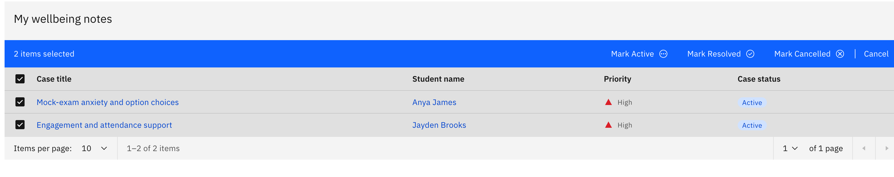

# Resolve, cancel, or reopen a case

Move a wellbeing case between **Active**, **Resolved**, and **Cancelled**. Resolve a case when it is finished, cancel one that is closed without resolution, or set a closed case back to **Active** to reopen it.

> **Note:** Changing a case's status needs **Wellbeing write** access (pastoral / student-support staff and leaders). Readers such as classroom teachers can open a case but cannot change its status.

1. Tick the notes you want to change

   On the **Wellbeing** landing page, or on the **Active notes** tab in **Track wellbeing notes**, use the tick-boxes to select one or more notes. You can select several at once and change them all together.

   

2. Choose the new status

   In the batch action bar, click **Mark Resolved**, **Mark Cancelled**, or **Mark Active**. A success toast confirms how many cases changed. Resolving or cancelling a case makes it read-only: no new comments, tasks, or edits are possible until you reopen it by setting it back to **Active**.

3. Reopen a closed case

   To reopen a resolved or cancelled case, find it in the landing page table, tick it, and click **Mark Active**. The case becomes editable again. Tick-boxes only appear on the active notes list, so the table batch actions are the reliable way to change status, and notes on the **Closed/resolved notes** tab cannot be re-ticked for a status change from that tab.

4. Undo a change

   Right after a change, the confirmation toast shows an **Undo** option for about 8 seconds. Click it to revert every note to its previous status, even across a mixed selection.
