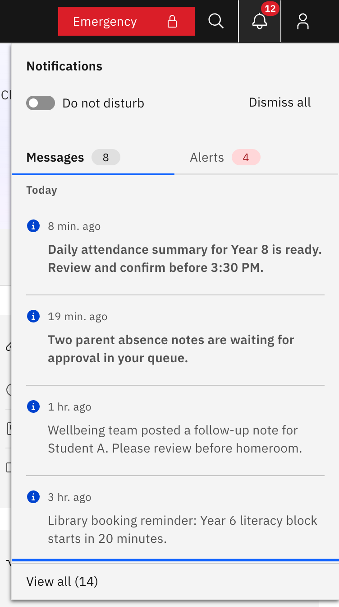
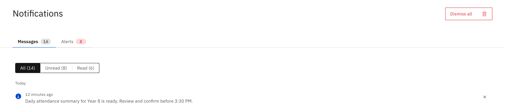

# View all your notifications

The Notifications page is the full-history view of everything the bell panel
shows, with filtering and paging the panel doesn't have. Every signed-in staff
member can open it.

1. Open the page

   Click the **bell** in the top header bar to open the slide-out panel, then
   click **View all** at the bottom. **View all** shows a count of how many
   items you have (for example "View all (12)"). There is no main-navigation
   link — the bell panel is the only way in.

   

2. Switch between Messages and Alerts

   The page has two tabs. **Messages** are items addressed to you, usually with
   a "go here" action; **Alerts** are school-wide operational and safety notices.
   Here the count tag on each tab shows the **total** number of items in that
   tab — unlike the bell panel, where the same-looking tag shows only the unread
   count.

   

3. Filter the list

   Use the **All / Unread / Read** filter to narrow what you see. Each option
   shows a live count for the current tab. Items are grouped under **Today** and
   **Previous**, newest first.

4. Load older items

   The page shows the first 10 items. Click **Load more** to reveal another 10
   at a time. Switching tab or changing the filter resets the list back to the
   first 10.

5. Open or dismiss an item

   Click any row to open it: this marks the item read and, for a message, takes
   you straight to what it's about (alerts just mark read). Each row also has a
   **dismiss (✕)** button that removes that item from your list only — it
   doesn't affect anyone else.
