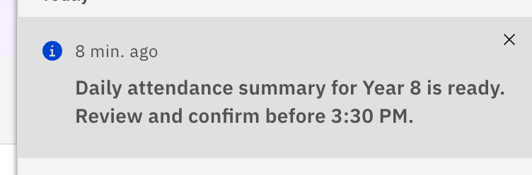
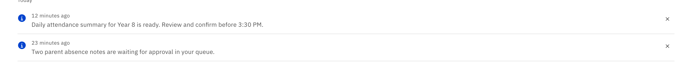

# Dismiss a notification

Remove a single notification you've dealt with so it stops cluttering your list.
Dismissing affects only your own view — it doesn't notify or change anything for
anyone else.

1. From the bell panel

   Click the **bell** in the top header bar to open the **Notifications** panel.
   Hover (or keyboard-focus) the notification you're done with and click its
   **dismiss (✕)** control. The item is removed from the list straight away.

   

2. Or from the Notifications page

   On the **Notifications** page, each row has its own **✕** button — click it to
   dismiss that item. This works on either the **Messages** or **Alerts** tab.

   
