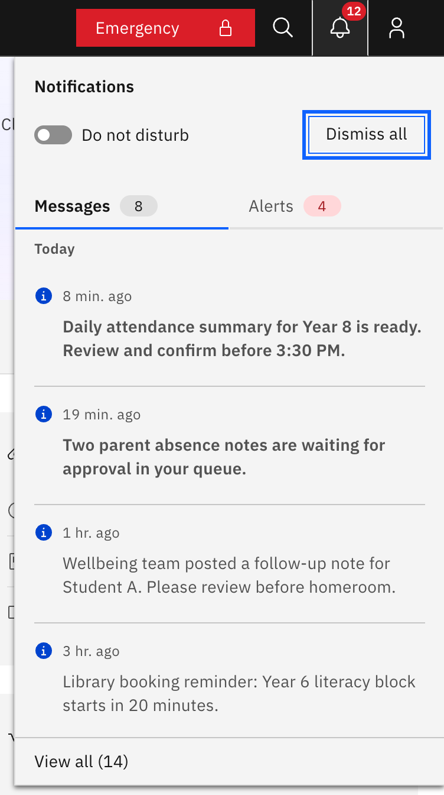
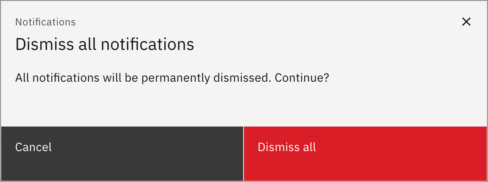

# Dismiss all notifications

Clear your whole notification list in one go. Every signed-in staff member can do
this; the controls are the same for everyone.

1. From the bell panel

   Click the **bell** icon (top right of the header) to open the **Notifications**
   panel, then click **Dismiss all** in the panel header. The list clears
   straight away, with no confirmation step.

   

2. From the Notifications page

   Open the bell panel, click **View all** at the bottom, then on the
   **Notifications** page click **Dismiss all** (top right). This version asks
   first: a pop-up reads *"All notifications will be permanently dismissed.
   Continue?"* — click **Dismiss all** to confirm or **Cancel** to back out.
   **Dismiss all** is disabled when there is nothing left to clear.

   

3. What gets cleared

   Dismissing only affects your own list — it does not notify or change anything
   for anyone else. Any favourited notifications are kept; everything else is
   removed.
