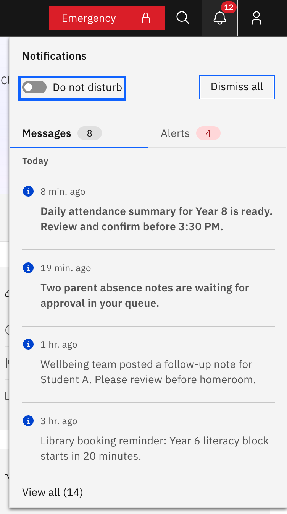

# Turn on Do not disturb

Do not disturb stops new notifications popping up on screen while you are busy,
without switching notifications off. Every signed-in staff member has this
control.

1. Open the notifications panel

   Click the **bell** icon at the top right of the header (it shows on every
   page). The **Notifications** slide-out panel opens.

   

2. Switch on Do not disturb

   Toggle **Do not disturb** in the panel header. New notifications stop showing
   the brief pop-up toast in the corner of the screen. Items still arrive in the
   panel and the bell badge still updates its count, so nothing is missed. The
   toggle is remembered between sessions, so turn it back off when you want
   pop-ups again.
